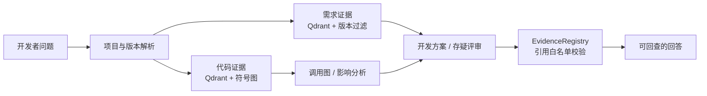
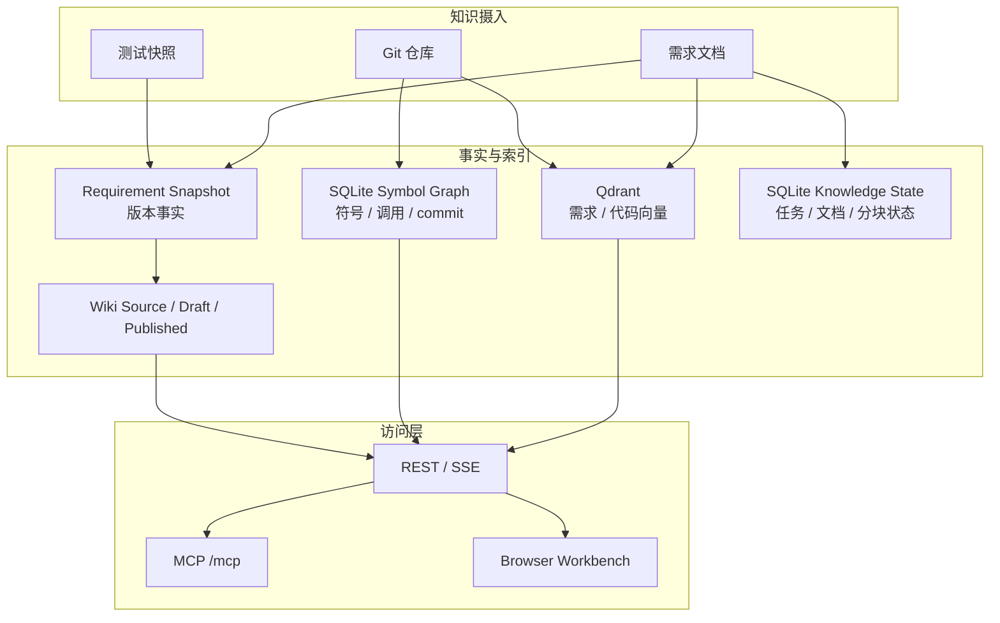

<div align="center">

# NEXUS

### 让 AI 写代码时，不再瞎编需求。

**Evidence-first knowledge platform for requirements, code, tests, and versioned engineering knowledge.**

<p>
  <a href="#快速开始">快速开始</a> ·
  <a href="#核心能力">核心能力</a> ·
  <a href="#mcp给-agent的入口">MCP</a> ·
  <a href="#文档地图">文档地图</a>
</p>

<p>
  <strong>0.9.4</strong> · Java 21 · Spring Boot 4.1 · Spring AI 2.0 · Qdrant · Tree-sitter · SQLite
</p>

</div>

---

## NEXUS 是什么？

NEXUS 把产品需求、Git 仓库、测试结果和版本资料，整理成一套**按业务项目与版本隔离、以证据为中心、同时服务人和 Agent**的研发知识平台。

团队可以在浏览器里阅读版本化 Wiki、检查需求索引和代码状态；Cursor、Codex 等开发 Agent 可以通过 MCP 调用同一套检索、源码、调用图和影响分析能力。

它的核心承诺很简单：

> **每个重要结论都能回答：来自哪个项目、哪个版本、哪条原文或哪段代码？**

## 为什么不是普通 RAG？

| 普通文档问答的风险 | NEXUS 的约束 |
|---|---|
| 拿错版本的规则回答当前问题 | 需求证据按 `documentId + version` 严格过滤 |
| 模型引用了没有召回过的内容 | `EvidenceRegistry` 维护本次请求的引用白名单 |
| 服务故障被误报成“知识库没有答案” | `SUCCESS`、`NO_RESULTS`、`DEGRADED`、`UNAVAILABLE` 分开表达 |
| 同名方法命中了错误文件 | Tree-sitter 符号图 + 精确符号通道 + 类范围召回 |
| 自动生成的 Wiki 被误当成产品事实 | 草稿必须经过审核，批准后才发布 |
| 多仓库项目被错误拆成多个孤岛 | 业务项目拥有共享需求，代码仓库独立同步和索引 |

---

## 一眼看懂：它如何把问题变成证据



典型问题：

```text
“5.1 版本的成长基金购买规则，具体由哪些代码实现？修改购买入口会影响哪些模块和测试？”
```

NEXUS 会把它拆成可验证的证据链：

```text
需求原文 / 版本
  → 需求章节与验收标准
  → 代码文件、类、方法与 commit
  → 静态调用关系与影响范围
  → 测试建议与版本差异
  → 带 requirement:* / code:* 的最终结论
```

---

## 核心能力

### 需求知识：从文档到可审阅事实

- 支持 PDF、DOCX、XLSX、HTML、TXT 及 HTML ZIP 等来源。
- Tika / Jsoup 解析、降噪、结构感知 Parent/Child 分块、SHA-256 去重。
- Qdrant dense + sparse 混合检索，RRF 融合，可选 BGE / LLM 重排。
- 需求证据携带章节路径、标题、需求编号、模块和验收标准。
- 需求版本快照支持基线继承、显式 `UPSERT` / `REMOVE` 和差异比较。
- 知识管理台可查看导入任务、文档、分块和 `DISCOVER → PUBLISH` 全阶段状态。
- 需求语义图是默认关闭的受控实验能力：按项目/文档/版本构建结构化窗口，支持证据跨度、可恢复抽取、声明审核、审计发布和可选混合图检索；仍不替换 Qdrant 需求主检索。
- 需求图工作台位于 `/requirement-graph.html`，支持异步构建、失败恢复、Local/Global/Hybrid 查询、邻域浏览和声明审核。

### 代码智能：不仅是“搜到一段代码”

- Java、Go、Python、TypeScript，Kotlin 按 Tree-sitter 能力探测启用。
- Tree-sitter 抽取类、接口、函数、方法、调用点和结构化代码 Chunk。
- SQLite 持久化按 `project + commit` 隔离的符号 / 调用图快照。
- 精确符号搜索、类名限定召回、代码语义检索和结构化重排协同工作。
- 影响分析明确区分：
  - `EXACT` / `SAME_FILE`：确定关系
  - `HEURISTIC`：启发式关系
  - `UNRESOLVED`：动态或歧义调用，不能当作确定影响

### 业务项目：一个产品，多套代码仓库

```text
BusinessProject: immortal
├── 共享需求：fengshen / 5.1
├── 版本主仓库：immortal-game-service
├── 自有仓库：bizgame-immortal-api
└── 可选公共库：显式引用、独立索引
```

- 需求、版本、Wiki 和权限属于业务项目。
- 分支、commit、Webhook、同步任务和代码索引属于仓库。
- 默认代码检索覆盖所有启用且可用的仓库。
- 代码命中携带仓库 ID、仓库名称、commit 和文件路径。
- 多仓库部分失败会明确返回降级状态和失败仓库，而不是伪装成完整成功。

### Wiki 与版本知识：自动生成，但不自动冒充事实

- Wiki 页面以 `projectId + version + featureId` 为稳定主键。
- 需求、代码、测试和 Wiki 可以独立比较，缺失来源显示 `NOT_AVAILABLE`。
- 生成过程先写入 draft，再经过评审、批准和原子发布。
- 需求版本落后于产品版本时，继续使用最后可用需求，但明确显示版本缺口。
- 冲突检测不自动裁决需求、代码或测试，只生成可审阅报告。

### MCP：把 NEXUS 接进开发现场

- Streamable HTTP：`/mcp`。
- 适配 Cursor、Codex、Claude Code 等 Agent 客户端。
- REST、SSE、MCP 共用项目、版本、权限和证据契约。
- 每次响应保留 `resolved`、`data`、`evidence`、`quality`、`warnings`、`truncated` 等结构化信息。

---

## 评测结果：代码定位不是“看起来相关”

在封神项目 500 道代码检索题上，NEXUS 与 BM25 MCP、RAGFlow、LightRAG 做了同题对比：

| 系统 | Recall@1 | Recall@10 | MRR@10 | P50 |
|---|---:|---:|---:|---:|
| **NEXUS（E10）** | **93.6%** | **99.6%** | **0.9596** | 334ms |
| codebase-memory MCP（BM25） | 80.4% | 92.0% | 0.8348 | 24ms |
| RAGFlow | 34.0% | 78.6% | 0.4609 | — |
| LightRAG | 15.0% | 46.6% | 0.225 | 1.0s |

这里的命中要求**同一条结果同时包含正确文件和正确符号**，不是只要文本里出现一个方法名。

> 这组数据只代表当前封神代码评测口径，不是对所有代码库和所有查询的普遍承诺。完整指标、口径差异和复测说明见[四向检索对比报告](docs/fengshen-code-retrieval-four-way-comparison.md)。

---

## 快速开始

### 环境要求

- JDK 21
- Maven 3.9+（或使用仓库内的 `./mvnw`）
- Docker（用于 Qdrant / Compose）
- 可访问的 OpenAI 兼容 API 网关

### 启动

```bash
cp .env.example .env
# 在 .env 中填写 OPENAI_BASE_URL、OPENAI_API_KEY 等配置
./scripts/nexus.sh start
```

Embedding 与 LLM 默认通过 OpenAI 兼容网关访问；Qdrant 由本地脚本或 Docker Compose 启动。启动后打开：

| 页面 | 地址 | 用途 |
|---|---|---|
| 总览 | [localhost:8080](http://localhost:8080/) | 运行状态与项目概览 |
| 知识库 | [localhost:8080/knowledge](http://localhost:8080/knowledge) | 导入、文档、分块、检索测试 |
| Wiki | [localhost:8080/wiki](http://localhost:8080/wiki) | 阅读已发布版本知识 |
| GitLab | [localhost:8080/settings/gitlab](http://localhost:8080/settings/gitlab) | 账号、仓库、Webhook 与同步 |
| 监控 | [localhost:8080/monitor](http://localhost:8080/monitor) | RAG 阶段与依赖状态 |
| MCP | [localhost:8080/mcp](http://localhost:8080/mcp) | Agent 工具端点 |

### 第一次验证

1. 上传一份你熟悉的需求文档。
2. 用需求中的真实问题执行检索。
3. 检查返回是否包含 `requirement:*`。
4. 打开证据，确认摘录能回到原文。
5. 再查询一个不存在的内容，确认系统返回 `NO_RESULTS` 或明确降级，而不是编造答案。

可复制的完整流程见[人工冒烟手册](docs/manual-smoke-test.md)。

---

## 接入 Cursor / Codex

在环境变量中准备 API Key：

```bash
export NEXUS_API_KEY='replace-with-your-key'
```

Cursor / Codex 使用 Streamable HTTP 配置：

```json
{
  "mcpServers": {
    "nexus": {
      "url": "http://127.0.0.1:8080/mcp",
      "headers": {
        "X-API-Key": "${env:NEXUS_API_KEY}"
      }
    }
  }
}
```

不要把真实 Key 写入仓库文件。必须使用 stdio 的客户端可以使用仓库提供的桥接脚本，详见 [MCP 快速入门](docs/mcp-quickstart.md)。

## MCP：给 Agent 的入口

| 工具 | 作用 |
|---|---|
| `nexus_search_requirements` | 按项目 / 需求文档 / 版本检索需求证据 |
| `nexus_search_code` | 检索带仓库和 commit 来源的代码证据 |
| `nexus_get_source` | 读取受控的仓库相对路径源码片段 |
| `nexus_development_plan` | 生成带需求和代码证据的开发方案 |
| `nexus_wiki_page` | 读取已发布 Wiki 页面 |
| `nexus_version_diff` | 比较需求、代码、测试和 Wiki 版本差异 |
| `nexus_code_graph` | 遍历静态符号调用图 |
| `nexus_impact_analysis` | 分析符号或 commit 区间的影响范围 |
| `nexus_review_doubts` | 生成按版本隔离的需求存疑清单 |
| `nexus_conflict_check` | 检查需求、代码、测试和 Wiki 声明冲突 |

权限分为 `PUBLIC_READ`、`OPERATE`、`WRITE` 和 `ADMIN`。依赖不可用、证据不足或结果被裁剪时，响应会保留稳定 warning code，Agent 不应把降级结果当成完整事实。

---

## API 示例

### 上传需求文档

```bash
curl -X POST http://localhost:8080/api/requirements/documents \
  -H "X-API-Key: $NEXUS_API_KEY" \
  -F 'file=@requirements.docx' \
  -F 'version=1.1.0' \
  -F 'documentId=example-requirements'
```

### 检索需求与生成存疑

```bash
curl -X POST http://localhost:8080/api/requirements/reviews \
  -H "X-API-Key: $NEXUS_API_KEY" \
  -H 'Content-Type: application/json' \
  -d '{"documentId":"example-requirements","version":"1.1.0","module":"example-module"}'
```

### 索引代码

```bash
curl -X POST \
  "http://localhost:8080/api/code/index/start?projectId=example-service" \
  -H "X-API-Key: $NEXUS_API_KEY"

curl "http://localhost:8080/api/code/index/status?projectId=example-service" \
  -H "X-API-Key: $NEXUS_API_KEY"
```

### 直接使用代码智能 API

```text
POST /api/code/search
POST /api/code/graph
POST /api/code/graph/symbols
POST /api/code/impact
GET  /api/code/source
GET  /api/code/status
```

多仓库业务项目的图谱、影响分析和源码请求需要明确 `repositoryId`；代码语义搜索支持业务项目级聚合和仓库筛选。

---

## 架构与数据边界



| 数据 | 主要存储 | 边界 |
|---|---|---|
| 需求原文向量与 Chunk payload | Qdrant | 只按项目、文档、版本检索 |
| 需求版本事实 | Requirement Snapshot | 可审阅、无向量、支持增量继承 |
| 代码符号与调用关系 | SQLite Symbol Graph | 按仓库与 commit 隔离 |
| 导入运行状态 | Knowledge Management SQLite | 旁路状态，不复制向量正文 |
| Wiki 源与草稿 | 文件型存储 | 草稿必须审核后发布 |
| 凭据与 Secret | 加密存储 / 环境变量 | 不进入 URL、日志和普通响应 |

**重要边界**：NEXUS 索引服务端仓库副本，代码相关接口默认只读。开发者仍在本机 Git 工作区编辑、提交和推送代码；NEXUS 不替代本地 Git。

---

## 文档地图

| 文档 | 内容 |
|---|---|
| [用户指南](docs/user-guide.md) | 安装、配置、需求摄入、代码索引、Wiki、API 和数据边界 |
| [MCP 快速入门](docs/mcp-quickstart.md) | Cursor、Codex、Claude Code 配置与排障 |
| [人工冒烟手测](docs/manual-smoke-test.md) | 从上传需求到验证证据链的复制清单 |
| [GitLab 自动接入](docs/gitlab-auto-onboarding-guide.md) | 账号连接、项目发现、批量导入和 Webhook |
| [四向检索评测](docs/fengshen-code-retrieval-four-way-comparison.md) | NEXUS、BM25 MCP、RAGFlow、LightRAG 对照 |
| [知识库价值与验证方案](docs/code-knowledge-base-value-and-validation-plan.md) | 需求、代码、测试、数值和版本关联方向 |
| [multipow × NEXUS](docs/multipow-nexus-integration.md) | Agent 工作区脚手架与证据闸门 |
| [更新日志](CHANGELOG.md) | 版本变更记录 |
| [后端检索规范](.trellis/spec/backend/retrieval-and-version-knowledge.md) | 版本、证据、权限、降级和 Wiki 契约 |

---

## 当前状态与路线

当前版本：**0.9.4**，活跃开发中。

已具备：

- 版本化需求检索、代码检索和 Wiki 知识。
- 多语言 Tree-sitter 代码索引与静态调用图。
- MCP 证据工具和 Agent 工作流 Prompt。
- 多仓库业务项目模型与 GitLab 自动接入。
- 知识管理、导入状态和安全降级。
- 默认关闭的需求语义图实验能力。

后续重点：

- 更完整的 SSO、配额和多实例共享状态。
- 需求实体关系与代码符号的审核式关联。
- 更大规模、更多业务语义查询的独立评测集。
- Wiki、需求、代码、测试之间更细粒度的过期传播。

自动生成内容始终先进入草稿或待审核状态。**未经发布的模型输出，不得当作已确认的产品事实——这句话同样适用于 NEXUS 自己。**

---

## 参与贡献

1. 使用 JDK 21，提交前运行 `./mvnw -B verify`。
2. 优先提交小而聚焦的变更，保持项目与版本隔离。
3. 不提交 `.env`、Qdrant 存储、私有业务文档或本地仓库副本。
4. 修改检索、版本知识或权限前，先阅读[后端契约规范](.trellis/spec/backend/retrieval-and-version-knowledge.md)。

当前仓库尚未发布许可证文件，暂仅限内部评估使用。
