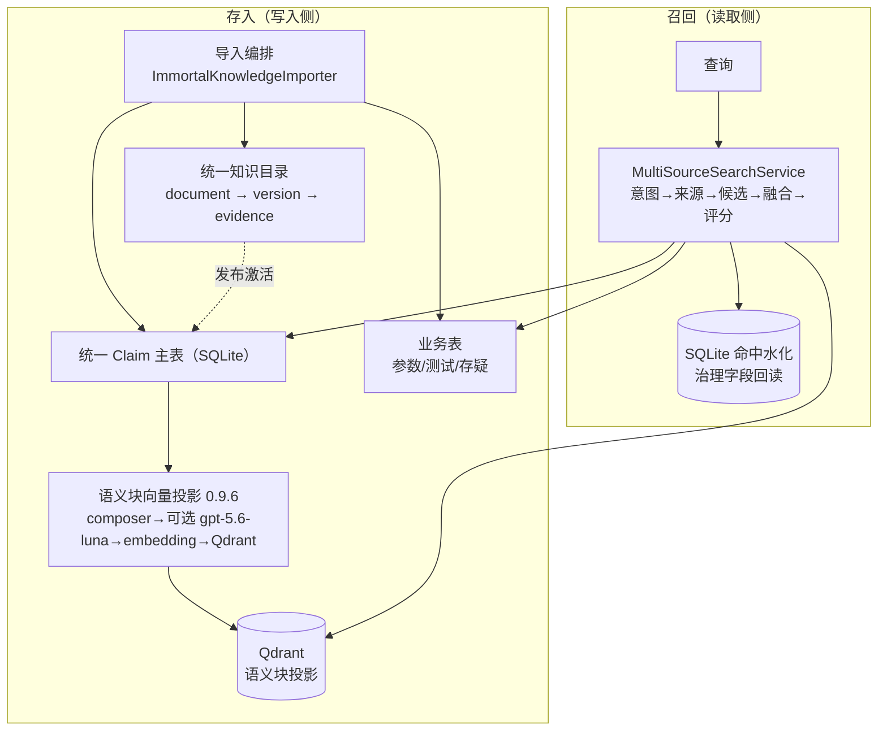
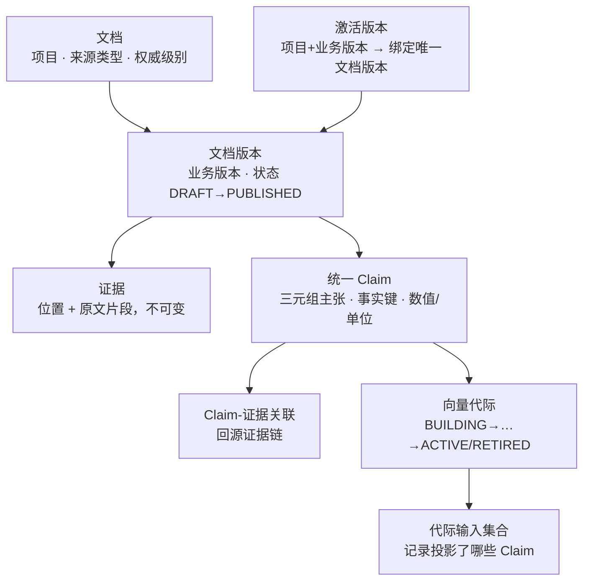
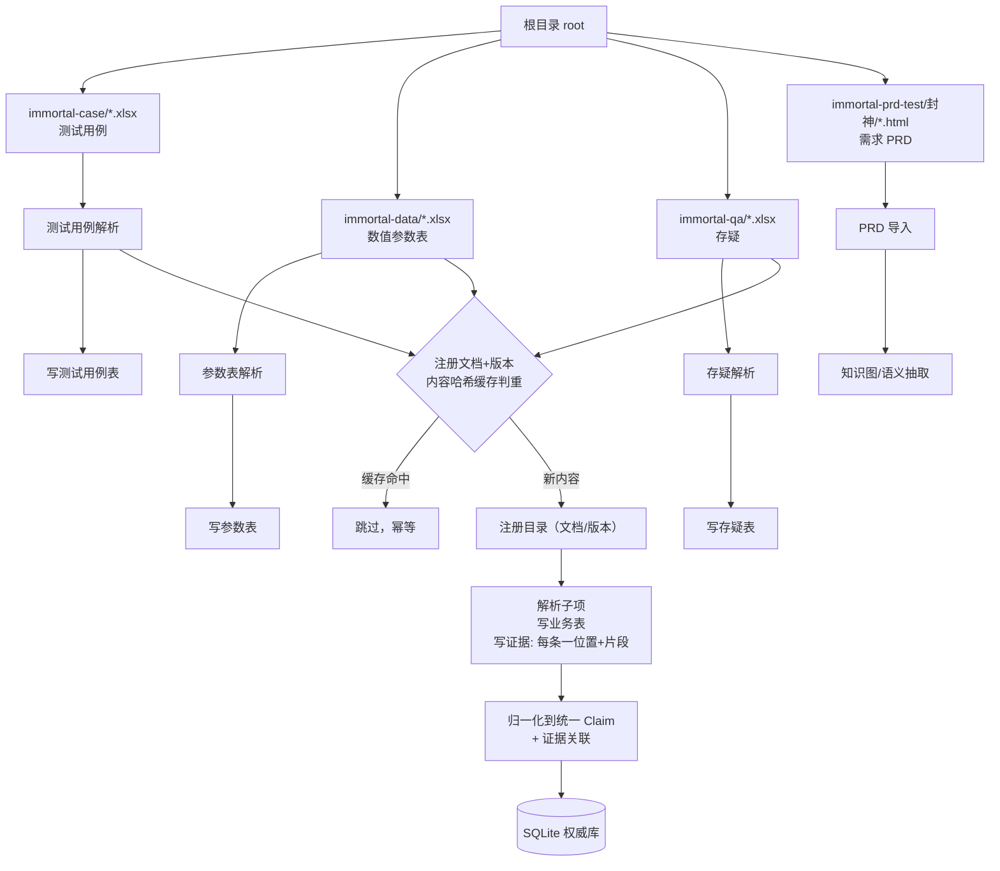
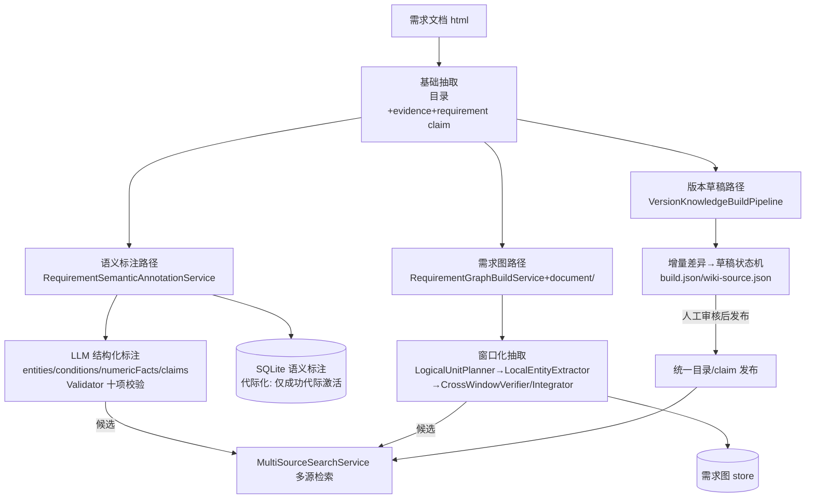
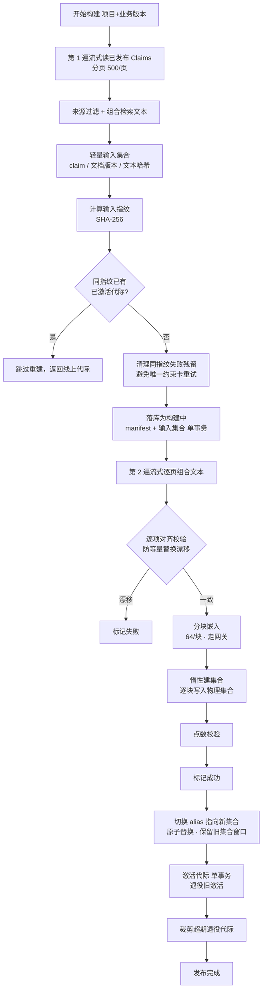
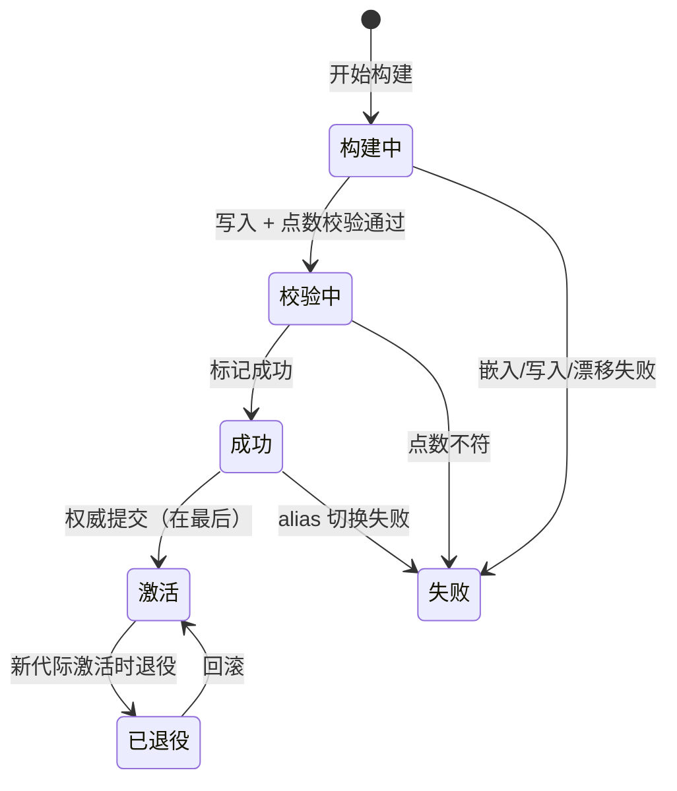
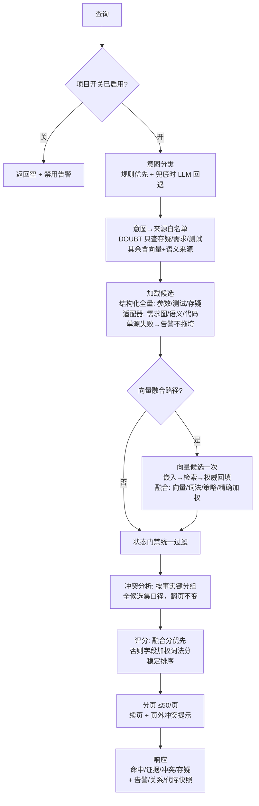
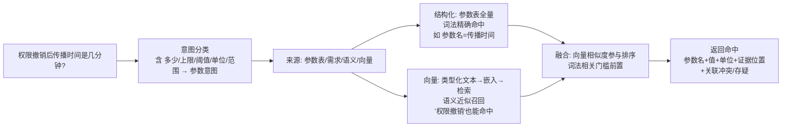
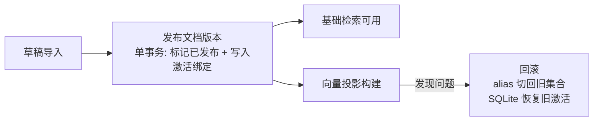

# 需求文档 × 数值表 × 多源知识：存入与召回实现说明

> 范围：`knowledge/multisource/**`（统一知识目录 + 多源检索）、`knowledge/multisource/vector/**`（0.9.6 Claim 向量投影）、
> `requirement/semantic|graph/**`（语义标注 / 需求图）。
> 本文用流程图讲清楚：需求文档、数值表（参数表）、测试用例、存疑等**不同来源的知识如何被统一表达、存储、向量化、并在检索时结合**。

---

## 0. 一图总览：双层架构

本系统是 **“SQLite 权威 + Qdrant 可弃投影”** 的双层结构：



核心原则：

- **SQLite 是权威**：目录、证据、Claim、代际行都落 `multi-source-knowledge.db`，删了还能重建；
- **Qdrant 是可弃投影**：嵌入向量只做近似召回，治理字段（状态、证据位置、生效区间）命中后从 SQLite 回读；
- **检索侧零写入**：查询只读，关系/冲突在构建期预生成，影子评测只记录不影响主路径。

---

## 1. 统一数据模型：一切知识都收敛成 Claim

不同来源（需求文档、参数表、测试用例、存疑）最终都表达为**统一三元组主张**：



关键点：

| 概念 | 作用 |
|---|---|
| `subject / predicate / object_value` | 三元组：“模块—参数—值”/“#需求—必须支持—30秒” |
| **`object_value + value_type + unit`** | **数值的表达**：值为客体，类型与单位结构化可算 |
| `fact_key` | 事实寻址键（`KnowledgeFactKeyGenerator` 生成）；冲突检测按它分组；向量文本组合也把 module 从它提取 |
| `knowledge_active_version` | `(project_id, business_version)` 唯一绑定一个激活文档版本——**一次投影一个文档**（见 §6 限制） |
| `content_hash` | 导入缓存：同内容文件跳过，幂等重导 |

---

## 2. 存入链路 A：导入编排——四类输入汇入统一目录

`ImmortalKnowledgeImporter.importAll(projectId, businessVersion, root)` 按目录批量导入：



要点：

- **每类文件 = 一个 `document_version`**；`registerIfAbsent` 按内容 hash 判重，重导不产生重复；
- 业务表（`multi_source_parameter/doubt/test_case/test_result`）保留**结构化增强字段**（数值的 min/max/unit、测试的步骤/预期），
  同时 `syncClaims` 把它们**归一化成统一 claim** 挂到 `knowledge_claim`——这就是“多源同表、结构保留”的结合基础；
- 每条 claim 都有 `evidence_location + excerpt_hash`，可回溯到原始文件的具体行/sheet。

---

## 3. 存入链路 B：数值表是怎么变成“数”的

以参数表（xlsx）为例，看“5 分钟 / 30秒 / 0.8~1.2”这类数值如何被结构化、再被语义化：

```mermaid
flowchart LR
    X[xlsx 参数表<br/>模块|参数|值|单位|版本] --> XR[读取表格]
    XR --> H[解析表头<br/>列角色映射]
    H --> ROW[逐行解析]
    ROW --> PS[结构化参数 Claim<br/>值/归一化值/min/max<br/>单位/精度/边界/类型/事实键]
    PS --> PT[(参数表<br/>按项目+版本全量召回)]
    PS --> SYN[归一化到统一 Claim<br/>主体=参数名 · 客体=数值<br/>类型/单位结构化]
    SYN --> EV[证据<br/>值 + 位置 sheet/行号]

    SYN --> COMP[文本组合器<br/>类型化渲染]
    COMP --> TXT[类型化检索文本<br/>参数名/用途/类型/单位/值/范围<br/>固定字段顺序，不含原始行号]
    TXT --> EMB[嵌入 text-embedding-v4<br/>via ai-gateway.momo.com]
    EMB --> Q[(Qdrant 语义块投影<br/>可选 gpt-5.6-luna 增强)]
```

**数值的三个层次**：

| 层 | 载体 | 用途 |
|---|---|---|
| 结构化数值 | `multi_source_parameter`（min/max/unit/precision/边界含否） | 精确数值问答、校验、参数对比 |
| 统一 Claim | `knowledge_claim.object_value + value_type + unit` | 跨源冲突检测（同 fact_key 数值不一致 → CONFLICTED） |
| 语义化向量 | composer 渲染的类型化文本 → 嵌入 → Qdrant 点 | 语义召回（问“权限撤销大概多久生效”） |

> 注意：**值-only 参数**（只有 Name 没 Purpose/Unit/ValueType）不建点——避免“孤立数值”主导嵌入文本。

---

## 4. 存入链路 C：需求文档的三条加工路径

需求文档（PRD HTML）不止进统一目录，还有三条独立加工线，产物都作为**检索候选**接入多源检索：



- **语义标注**：`REQUIREMENT_SEMANTIC` 来源，结果默认只是候选（Authority ≤ SECONDARY、EXTRACTED 状态），未经人工审核不成为确认事实；
- **需求图**：`REQUIREMENT` 来源，窗口化 + 跨窗验证，persist 证据与不确定/冲突声明；
- **草稿**：永不自动上线，差异改动人审后才发布为正式 claim。

---

## 5. 存入链路 D：Claim 向量投影（0.9.6）——如何把“结合后的知识”整体打成向量索引

投影的输入就是统一 `knowledge_claim`（需求+参数+测试+存疑四类），一次构建 = 一个代际 = 一批 Qdrant 物理集合 + 一个 alias。

### 5.1 构建流水线（两遍流式）



生产路径在组合文本前先按 `sourceType + canonical_module` 聚合同一玩法的多版本页、
子页、优化页和支撑表；一个玩法/系统在实体层只建立一张玩法卡，原始 Claim、数值、版本和 Evidence 逐条保留。
Qdrant 语义块仅在组合文本超过 `block-max-chars` 时按稳定顺序切分，切分只改变召回粒度，命中后仍批量水化全部原始事实。

### 5.2 代际状态机与失败保护



关键失败保护（历次 review 固化）：

- **alias 三态语义**：查询失败（未知）≠ 确认不存在——未知时保留集合不动 alias，留人工对账（防悬空 alias）；
- **markActive 失败**：代际强制 FAILED，绝不残留 `SUCCESS + physical_collection=null` 被 `findReusableGeneration` 误复用；
- **同指纹重试**：先 `deleteSupersededGenerations` 清失败残留，`unique(scope+fingerprint+...)` 不阻塞重试；
- **回滚目标校验**：`collectionExists` 确认目标物理集合还在 retain 窗口内，否则明确拒绝，不把 alias 指向已删集合；
- **并发锁**：build / rollback / rollback-to 共用同 scope 条带锁，杜绝 SQLite/Qdrant 分叉。

### 5.3 文本组合器：不同类型“各说各话”，但格式稳定

| 来源 | 渲染字段（固定顺序，空字段跳过） |
|---|---|
| Requirement | `[Requirement]` Subject / Predicate / Value / Module / Fact key |
| Parameter | `[Parameter]` Name / Purpose / Value type / Unit / Value / Scope(Version) / Fact key |
| Test Case | `[Test Case]` Title / Preconditions / Expected result / Module / Fact key |
| Doubt | `[Doubt]` Question / Answer / Module / Fact key |

同一 claim 的文本不随行序/填充漂移（确定性），指纹才能命中复用；`textHash=SHA-256` 进入 manifest 与 Qdrant payload，构建侧与检索侧校验一致。

---

## 6. 召回链路：多源检索怎么把“结合后的知识”拿出来

单入口 `MultiSourceSearchService.search(projectId, version, query, intent?, limit, page)`：



### 6.1 数值类问题的两路召回

问“**权限撤销后传播时间是多少**”→ 意图 `PARAMETER`，两路并行：



数值的“精确”和“语义”由此互补：**结构化的 min/max/unit 保证精确；向量化保证“绕着说”也能找到**。

### 6.2 需求文档与数值表在检索层的“结合”点

1. **同表同源**：需求 claim 与参数 claim 都来自 `knowledge_claim`，同一检索结果集内按 `sourceType` 区分；
2. **fact_key 对齐**：`module` 从 fact_key 提取，需求与参数同模块可互见；冲突检测按 fact_key 分组（同一事实、多来源数值不一致 → CONFLICTED 扣分并提示）；
3. **一致性对比**：`CONSISTENCY` 意图同时召回需求、测试、参数、代码——测试覆盖/参数确认 与 需求规范碰撞即产生冲突提示；
4. **融合加权**：向量命中给**排序分**不给**准入权**——词法不相关或被状态门禁过滤的候选不会因一次向量命中混入结果；
5. **证据回读**：命中的 claim 治理字段（状态、authority、evidenceLocation）从 SQLite 权威回读，Qdrant payload 只是坐标。

---

## 7. 发布语义与已知限制



- **一次投影一个文档版本**：`knowledge_active_version` 主键 `(project_id, business_version)` 一对一；`findPublishedClaimsByProjectVersionPage` 只投影该绑定文档的 claim（Phase C Review 3 治理边界，防同版本多文档混入）。**要让全部 199 个文档的 claim 一起进向量投影**，需要放宽该查询到“该 business_version 下所有 PUBLISHED 文档”并配套批量发布机制——这是有意为之的决策，改动会推翻既有契约，需产品确认。
- **传统结构化检索不受此限**：`multi_source_parameter` 等按 `(project, version)` 全量聚合，与 DRAFT/PUBLISHED 无关，多文档数据天然一起召回。
- **语义/图路径也按 version 聚合**（aggregate 显示 `activeDocumentCount`），不受单文档绑定限制。

---

## 8. 运维入口速查

| 动作 | 接口 |
|---|---|
| 触发 Claim 向量构建 | `POST /api/knowledge/multi-source/claim-vector/build {projectId, businessVersion}` |
| 查询代际状态 | `GET .../claim-vector/status?projectId=&businessVersion=` |
| 质量门 | `GET .../claim-vector/quality-gate?projectId=&businessVersion=` |
| 回滚到上一代 / 指定代际 | `POST .../claim-vector/rollback` / `.../rollback-to` |
| 多源检索 | `POST /api/knowledge/multi-source/search {projectId, version, query, intent?, limit, page}` |
| 语义构建 | `POST /api/requirement-semantic/builds`（页面暂无按钮，需管理端调用） |

> 模型拓扑备忘：**嵌入 = text-embedding-v4 @ ai-gateway.momo.com**（OpenAI 兼容网关，1024 维）；
> **BGE = 本地重排器 :8081**（仅 rerank 阶段）；Ollama bge-m3 仅备选。查嵌入问题看网关，不看 :8081。