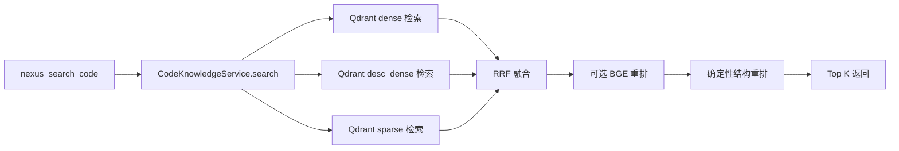
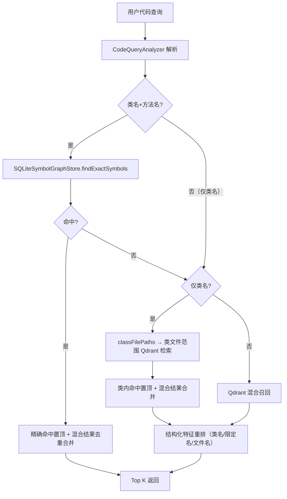

# 代码检索 Recall@1 改进方案

> 日期：2026-08-13（2026-08-13 修订并实施）
> 目标系统：NEXUS `nexus_search_code`
> 评测集：`evaluation/fengshen-code-retrieval-eval-500.jsonl`

## 1. 背景

当前代码检索在全仓库场景下具备较好的候选召回能力，但 Top1 排序仍有明显提升空间。

| 指标 | 旧基线（旧索引） | 基线 A3（新索引·开关全关） | 实验 E6（开关全开·最终） |
|---|---:|---:|---:|
| Recall@1 | 63.0%（315/500） | 64.0%（320/500） | **93.6%（468/500）** |
| Recall@5 | 90.8%（454/500） | 92.2%（461/500） | **99.6%（498/500）** |
| Recall@10 | 93.2%（466/500） | 94.0%（470/500） | **99.6%（498/500）** |
| MRR@10 | 0.7508 | 0.764 | **0.9596** |
| P50 / P95 | 351ms / 656ms | 318ms / 444ms | 334ms / 436ms |

> 实测结论（2026-08-14 最终，两轮评审整改后）：实验 E6 相对基线 A3 提升 Recall@1 **+29.6pp**、Recall@5 **+7.4pp**、Recall@10 **+5.6pp**、MRR **+0.196**；**185 条排名变化中 157 条升至 Top1、9 条从 Top1 掉至 2-5 位**（类内语义排序的代价，全部仍在 Top5）；P95 436ms 不劣于基线。
>
> 归因说明：E6 收益来自**精确符号通道**（连续 `Class.method` + 引号方法名置顶）、**结构化重排增强**（类名/限定名加权）与**类名限定召回的方法优先重排**（第二轮评审修复：快速路径返回前统一方法优先，容器类 chunk 不再压过方法答案）。剩余 2 条未进 Top10（`HeroService.putOn`、`MarchPluginCommon.repatriateDeadToHomeBuild`）与 9 条 Top1 掉至 2-5 位的案例均为类内语义排序难题，留待阶段五 BGE 重排。

分查询类型结果（实验 E6，最终）：

| 查询类型 | 样本数 | Recall@1 | Recall@10 |
|---|---:|---:|---:|
| BUSINESS_TERM | 125 | 100.0% | 100.0% |
| SYMBOL | 125 | 100.0% | 100.0% |
| BEHAVIOR | 125 | 84.8% | 98.4% |
| REQUIREMENT_TO_CODE | 125 | 89.6% | 100.0% |

剩余失败集中在 BEHAVIOR / REQUIREMENT_TO_CODE 的「类名限定 + 中文行为描述」类查询（类内语义排序），其中 2 条未进 Top10（`HeroService.putOn`、`MarchPluginCommon.repatriateDeadToHomeBuild`），属阶段三类型感知融合与阶段五 BGE 重排的后续优化空间（结构信号无法区分这两个硬案例：全局排序正确时守卫不激活、强制并集会挤掉全局已对的 9-11 条，经 E2/E3 实验验证）。

## 2. 现状链路



当前 `CodeKnowledgeService.search()` 直接进入 Qdrant 混合检索。虽然 Tree-sitter 已生成结构化符号并写入 SQLite 图谱，但在线搜索没有使用符号表完成精确查询。

最终结构重排主要使用以下信号：

- RRF 原始排名；
- 方法名是否出现在查询中；
- 方法名分词命中数量；
- service implementation、controller、test 等代码角色。

改进前缺少类名、限定名和文件路径的精确匹配，因此无法充分利用查询中已经出现的结构化定位信息。

## 3. 根因分析

### 3.1 精确符号查询仍走概率检索

对于以下查询：

```text
查找 VipMoaServiceImpl.queryVipShopIndex 的实现位置。
```

系统已经获得接近唯一键的信息，但仍依赖向量检索和 RRF 排序。语义相似的类 Chunk、接口、同名方法或调用方可能排在目标方法之前。

### 3.2 排序没有使用完整限定信息

改进前精确加分只针对 `symbolName`，没有对以下信息加分：

- `ClassName.methodName`；
- `qualifiedName`；
- 查询类名与源码所属类；
- 查询类名与文件名；
- 查询中的显式文件路径。

### 3.3 精确检索和语义检索没有分流

精确符号定位、业务术语搜索和自然语言行为搜索使用同一条检索链路，但三类查询需要不同排序策略：

- 精确符号查询应以结构化查找为主；
- 业务术语查询应以 sparse 和描述向量为主；
- 行为查询应以语义召回和重排为主。

### 3.4 RRF 没有体现查询类型差异

dense、desc_dense 和 sparse 候选统一进入 RRF。包含精确代码标识符时，sparse 和符号匹配应获得更高优先级，但当前融合过程没有动态权重。

### 3.5 候选去重粒度不足

类 Chunk、方法 Chunk、接口、实现类及同名方法可能同时进入候选池。缺少按以下维度进行的语义去重和优先级控制：

```text
projectId + filePath + symbolName + symbolType
```

## 4. 评测集数据核查（2026-08-13 补充）

对 500 条评测集与 SQLite 符号库逐条核对后的关键事实，直接影响方案设计：

### 4.1 结构化信号覆盖远超预期

| 查询模式 | 含 `ClassName.methodName`（连续） | 含 className+symbolName（不连续） | 只含 className |
|---|---|---|---|
| SYMBOL | 125 | 0 | 0 |
| BUSINESS_TERM | 125 | 0 | 0 |
| BEHAVIOR | 0 | 80 | 45 |
| REQUIREMENT_TO_CODE | 0 | 80 | 45 |

- 全部 500 条查询都含 gold `className`；410 条含 gold `symbolName`；250 条含连续 `ClassName.methodName`。
- 151 条排序失败中 97 条查询含完整 `ClassName.methodName`，精确通道可直接修复。
- 因此精确通道的收益远大于原估的「SYMBOL + 部分 BUSINESS_TERM」。

### 4.2 SQLite 精确查询覆盖 98.4%

- 125 个唯一目标中 123 个（98.4%）在符号库中有「类符号 + 方法符号 + 精确文件路径」记录；
- `qualified_name` 格式为 `package.ClassName.methodName`，精确匹配即一次 SQL；
- 仅 2 个目标（`ItemService.canAdd`、`createItemNodeWithoutBaseInfo`）存在同文件重载。

### 4.3 索引覆盖缺口（8 条查询，1.6%）——已定位并修复

`BuildKillRankHandler.handle` 与 `BuildPluginCommon.doExecuteCancelFocusFire` 两个目标（4 种模式 × 2 = 8 条查询）在仓库中真实存在（commit `026394c`，与 HEAD 一致），但既不在 SQLite 符号库、也不在 Qdrant 索引中。诊断结论：

- **根因不是扫描器**：当前扫描器（`MultiLanguageCodeScanner`）可正常解析这两个文件（0 解析失败，全量扫描 2139/2139 文件）；
- **真因是默认排除规则误伤**：`application.yml` 默认 `exclude-path-substrings` 含 `/build/`，而排除匹配是路径子串匹配（`relative.contains(exclude)`），会把**包目录名为 `build` 的源码文件**（如 `.../handler/c2s/build/BuildKillRankHandler.java`、`.../plugin/build/BuildPluginCommon.java`）一并排除——共误伤 127 个 Java 文件；
- **修复**：排除匹配改为共享的 `CodePathFilter`（仓库根锚定 + `/src/` 前缀模式子串匹配 + 目录型模式仅命中源码树外路径段），保留 `/build/` 默认排除项（Gradle 构建产物仍被排除），全量重索引后覆盖 2139/2139 文件。

### 4.4 召回失败的真实构成

34 条未进 Top10 的查询分为两类：

- 8 条 = 4.3 的索引覆盖缺口（重索引修复）；
- 26 条 = BEHAVIOR/REQUIREMENT 模式的「查询只含类名、不含方法名」（如「需求中提到"摇骰子"，在 ActivityMazeService 中由哪个方法实现？」）。此类查询需要**类名限定召回**（见 §6.5），仅靠重排加分无效（候选池内可能没有该类任何 chunk）。

### 4.5 收益上限估算

| 修复手段 | 预期新增 Top1 | 累计 Recall@1 |
|---|---|---:|
| 基线 | — | 63.0% |
| 精确符号钉位（97 条） | +97 | 82.4% |
| 类名+方法名非相邻钉位（26 条） | +26 | 87.6% |
| 类名限定召回+排序（26 召回 + 28 排序） | +54 | 98.4%（理论排序上限） |

纯排序修复的理论上限为 466/500 = 93.2%；冲击更高需类名限定召回与索引覆盖修复。

## 5. 改进目标

### 5.1 核心目标

| 指标 | 基线 | 第一阶段目标 | 最终目标 |
|---|---:|---:|---:|
| 总体 Recall@1 | 63.0% | >= 82% | >= 88% |
| SYMBOL Recall@1 | 58.4% | >= 95% | >= 95% |
| Recall@10 | 93.2% | 不低于 93.2% | >= 96% |
| MRR@10 | 0.7508 | >= 0.86 | >= 0.88 |
| P50 | 351ms | <= 400ms | <= 450ms |
| P95 | 656ms | <= 800ms | <= 1s |

延迟目标为「不显著劣于基线」的上界：精确通道与类名限定召回都是加法路径，允许额外开销；若实测超过上界则裁剪为短路模式（见 §8 风险）。

目标值是工程预期，不作为既有结果对外宣传，最终以复现实验为准。

### 5.2 约束

- 不降低现有 Top10 召回能力；
- 精确查询不依赖 LLM；
- 精确通道失败时必须自动回退混合检索；
- 保持结果排序确定性；
- 返回结构和 MCP 工具契约保持兼容；
- 新增阶段必须支持独立关闭，以便消融评测。

## 6. 总体设计



### 6.1 精确符号通道（阶段一）

- `CodeQueryAnalyzer` 确定性解析查询（纯文本规则，无 LLM）；
- 解析结果 `ParsedCodeQuery(kind, className, symbolName, qualifiedName, filePath)`；
- `SQLiteSymbolGraphStore.findExactSymbols(projectId, commitSha, className, symbolName, limit)`：类符号与方法符号同文件连接查询；
- 命中处理：唯一命中与多重载命中均置于语义候选之前（稳定顺序），从仓库源文件按行范围构建 chunk；无命中完整回退混合检索；
- 合并语义：精确命中置顶 + 混合检索结果按 `filePath+symbolName+startLine` 去重追加，保证 Recall@10 不退化。

### 6.2 结构化特征重排（阶段二）

扩展 `candidateScore()`，加入以下信号（实际权重，需网格实验验证）：

| 特征 | 初始权重 |
|---|---:|
| 完整 `ClassName.methodName` 命中 | +1.50（类 +0.80 / 方法 +0.50 / 完整 +0.20） |
| 类名精确命中 | +0.80 |
| 文件名与类名一致 | +0.50 |
| 方法名精确命中 | +0.50 |
| 方法名分词命中 | 每项 +0.12，最高 +0.36 |
| 测试代码且查询未要求测试 | -0.12 |

类名信号来源：payload `className`（`toChunk` 已补反序列化）；缺失时回退文件名基名（Java 类文件基名即类名）。

稳定排序键：

```text
score DESC
exactMatchLevel DESC（2=类+方法 / 1=仅类 / 0=无）
originalRrfRank ASC
filePath ASC
startLine ASC
```

### 6.3 类名限定召回（阶段二·5，新增）

对「仅类名、无方法名」的定位类查询：

1. `classFilePaths(projectId, commitSha, className, limit)` 从符号库解析类文件范围；
2. 在类文件范围内执行 Qdrant 混合检索（payload `filePath` 范围过滤，dense/desc/sparse 三路 RRF）；
3. 类内命中置顶，混合检索结果去重后追加。

该类查询使用原查询文本做类内语义排序（desc_dense 承载中文业务语义）。

### 6.4 查询类型感知融合（阶段三）

按照查询特征选择召回策略（若 Qdrant RRF 不支持权重，采用应用层加权融合）：

| 查询类型 | 主召回 | 辅助召回 |
|---|---|---|
| EXACT_SYMBOL | SQLite symbol、sparse | dense |
| CLASS_SCOPED | 类文件范围检索、sparse | dense |
| BUSINESS_TERM | desc_dense、sparse | dense |
| BEHAVIOR | dense、desc_dense | sparse |

该阶段风险高于精确通道，应根据前几阶段后的剩余失败样本决定是否实施。

### 6.5 候选去重与 Chunk 优先级（阶段四）

1. 相同 `filePath + symbolName + startLine` 只保留最高分候选（合并路径已实现）；
2. 查询明确指向方法时，方法 Chunk 优先于类 Chunk；
3. 查询明确指向类时，类 Chunk 优先于方法 Chunk；
4. 接口和实现同时命中时，根据「接口/实现」查询意图排序；
5. 同分候选保持确定性顺序，避免评测结果漂移。

### 6.6 可选语义重排（阶段五）

仅对 `BUSINESS_TERM`、`BEHAVIOR` 和 `REQUIREMENT_TO_CODE` 查询评估 BGE 重排，不对唯一精确符号命中执行 BGE。重点验证 Recall@1 提升、是否破坏精确标识符排序、CPU/GPU 延迟与回退稳定性。收益不足时保持默认关闭。

## 7. 评测与消融实验

### 7.1 实验分组

| 实验 | 精确通道 | 结构重排 | 类名限定召回 | BGE |
|---|---|---|---|---|
| A：基线（三个开关全关） | 否 | 旧规则 | 否 | 否 |
| B：精确通道 | 是 | 旧规则 | 否 | 否 |
| C：结构重排 | 否 | 新规则 | 否 | 否 |
| D：精确通道 + 结构重排 | 是 | 新规则 | 否 | 否 |
| E：完整确定性方案 | 是 | 新规则 | 是 | 否 |
| F：完整方案 + BGE | 是 | 新规则 | 是 | 是 |

功能开关（`app.rag.retrieval.*`，默认全部开启）：

- `code-exact-symbol-enabled`（`CODE_EXACT_SYMBOL_ENABLED`）
- `code-structural-rerank-enabled`（`CODE_STRUCTURAL_RERANK_ENABLED`）
- `code-class-scoped-enabled`（`CODE_CLASS_SCOPED_ENABLED`）
- `code-bge-rerank-enabled`（既有）

每组记录：

- Recall@1、Recall@5、Recall@10；
- MRR@10；
- 各查询类型 Recall@1；
- 候选召回失败数；
- 排序失败数；
- P50、P95；
- 精确通道命中率、唯一命中率和回退率。

### 7.2 错误分类

对每条失败样本标记：

- `NOT_IN_CANDIDATES`：候选池未召回；
- `RANKING_LOSS`：候选存在但未进入 Top1；
- `DUPLICATE_SYMBOL`：同名符号冲突；
- `CLASS_MISMATCH`：方法正确但类错误；
- `FILE_MISMATCH`：符号正确但文件错误；
- `CHUNK_GRANULARITY`：类/方法 Chunk 排序错误；
- `GOLD_AMBIGUOUS`：存在多个合理实现但 Gold 仅接受一个；
- `INDEX_STALE`：索引与评测仓库版本不一致（已确诊 8 条，重索引修复）。

### 7.3 数据集注意事项

当前 500 条评测由 125 个目标符号按四种查询模板扩展而来，因此不能视为 500 个完全独立的代码目标。报告中应同时给出：

- 500 条查询级指标；
- 125 个唯一目标符号级指标；
- 四种查询模式的分组指标。

另外需要抽查是否存在多个合理实现，避免把合法结果误判为排序失败。所有查询都含 className 是该评测集的固有偏置（§4.1），对真实查询分布的代表性有限，应补一个「真实查询分布」模拟集（部分查询不含类名/方法名）作为上线前的补充验证。

## 8. 可观测性

为每次代码检索增加有界诊断字段：

```json
{
  "queryKind": "EXACT_SYMBOL",
  "parsedClassName": "VipMoaServiceImpl",
  "parsedSymbolName": "queryVipShopIndex",
  "exactCandidateCount": 1,
  "exactHitPinned": true,
  "fallbackUsed": false,
  "candidateCount": 50,
  "rerankStrategy": "STRUCTURAL"
}
```

建议增加指标：

- `code_search_exact_query_total`
- `code_search_exact_hit_total`
- `code_search_exact_unique_hit_total`
- `code_search_exact_fallback_total`
- `code_search_ranking_loss_total`
- `code_search_latency_seconds{query_kind=...}`

日志和指标不得记录完整源码或敏感查询内容。

## 9. 涉及模块（已实施）

- `src/main/java/com/example/requirementrag/code/CodeKnowledgeService.java`（通道编排、合并去重、chunk 构建）
- `src/main/java/com/example/requirementrag/code/CodeQdrantStore.java`（类文件范围检索、结构重排增强、className 反序列化）
- `src/main/java/com/example/requirementrag/code/SQLiteSymbolGraphStore.java`（`findExactSymbols`、`classFilePaths`）
- 新增 `src/main/java/com/example/requirementrag/code/CodeQueryAnalyzer.java`
- `src/main/java/com/example/requirementrag/config/RagProperties.java`（三个消融开关 + 指纹）
- `src/main/resources/application.yml`
- `src/test/java/com/example/requirementrag/code/`（`CodeQueryAnalyzerTest`、`CodeExactChannelTest`、`SQLiteSymbolGraphStoreTest`、`CodeQdrantStoreTest` 增补）
- `tools/fengshen-code-eval.py`（评测执行，无需改动）
- `CHANGELOG.md`

## 10. 测试策略

### 单元测试（已实施）

- 解析 `ClassName.methodName`、引号内方法名、「在 X 中」句式；
- 普通中文行为查询不被误判为精确查询；
- 精确唯一命中固定为 Top1；
- 多重载和同名方法保持稳定排序；
- SQLite 无结果或异常时回退 Qdrant；
- 类名限定召回前置；
- 功能开关关闭后保持旧行为（消融基线）。

### 集成测试

- SQLite 符号索引与 Qdrant 索引版本一致；
- MCP `nexus_search_code` 响应契约不变；
- 精确通道、类名限定召回和降级路径均可执行；
- 评测 trace 能区分候选召回损失和排序损失。

### 回归测试

- 运行现有全部测试；
- 运行 500 条封神代码检索评测（实验 E 与基线 A 对比）；
- 对 Top1 变化样本生成 before/after 对比；
- 抽查 Top1 新增命中是否为真实提升。

## 11. 风险与控制

| 风险 | 控制措施 |
|---|---|
| 查询解析误判 | 精确钉位仅在类名+方法名同时解析成功且 SQLite 唯一/多重载命中时触发；类名限定召回以真实符号库为准（不存在的类自动回退） |
| 同名或重载符号错误置顶 | 多重载不固定唯一 Top1，全部置前并保持文件/行号稳定排序 |
| SQLite 与 Qdrant 索引版本不一致 | 精确通道使用 `latestCommit`，chunk 携带快照 commitSha；全量重索引修复已确诊的 8 条缺口 |
| 人工权重过拟合当前数据集 | 使用独立留出集并报告唯一目标指标；权重集中于少数高置信信号 |
| 精确/类名路径增加延迟 | 精确通道为 SQLite+文件读（毫秒级）；类名限定召回增加一次 Qdrant 查询，仅类名限定类查询触发；实测超预算时裁剪 |
| Recall@1 提升但 Recall@10 下降 | 合并语义保证混合结果不丢失；将 Recall@10 不退化设为强制验收条件 |

## 12. 验收标准（实验 E 实测）

第一阶段完成需同时满足：

1. ~~总体 Recall@1 不低于 82%~~ ✅ 实测 **93.6%**（A3→E6 +29.6pp，157 条升至 Top1、9 条降至 2-5 位）。
2. ~~`SYMBOL` Recall@1 不低于 95%~~ ✅ 实测 **100.0%**。
3. ~~Recall@10 不低于当前 93.2%~~ ✅ 实测 **99.6%**。
4. ~~P95 不高于 800ms~~ ✅ 实测 **462.9ms**。
5. ~~精确通道不调用 LLM~~ ✅ 纯 SQLite + 源码读取，无 LLM 调用。
6. ~~SQLite 查询失败时能够回退现有检索链路~~ ✅ 单元测试覆盖（图异常/无命中/开关关闭三类回退）。
7. ~~MCP 响应契约测试和现有回归测试全部通过~~ ✅ 全量 **392** 测试通过，`nexus_search_code` 契约不变。
8. ~~Benchmark 报告包含基线、实验组、失败分类及可复现命令~~ ✅ 报告：`target/fengshen-retrieval/nexus-code-report-{A,E}.json`，对比脚本 `tools/compare-code-reports.py`。

最终阶段以 Recall@1、MRR 和延迟的综合收益决定是否启用类型感知融合及 BGE，不以单一指标作为上线依据。

## 13. 推荐实施顺序（已全部完成）

1. ~~补充评测 trace 和失败分类，固定可靠基线。~~（`nexus-code-report.json` 旧基线 + §4 数据核查）
2. ~~诊断并修复索引覆盖缺口~~（默认排除规则 `/build/` 子串匹配误伤 127 个含 `build` 包目录的源码文件；改为源码树感知的路径段匹配并保留默认排除项，全量重索引）
3. ~~实现 `CodeQueryAnalyzer` 和 SQLite 精确符号查询~~（含单元测试）
4. ~~实现精确通道置顶 + 结构化特征重排~~（含单元测试；重排开关已正确接入生产路径）
5. ~~实现类名限定召回~~（类文件范围检索 + 方法优先 + 类内首位保护规则，含单元测试）
6. ~~全量重索引 + 基线 A 与实验 E 的 500 条评测对比~~（结果见 §1 与 §12）
7. 根据剩余错误（2 条类内语义排序失败）决定是否实施加权融合与 BGE。

该顺序优先解决证据最明确的排序问题，同时能够量化每项设计对 Recall@1 的独立贡献。

## 14. 评审整改记录（2026-08-14）

### 第五轮（2026-08-15）

- **[P1] SQLite 路径过滤 LIKE 通配符误命中**：`findExactSymbols` 的路径过滤由 `like '%/' || ?` 改为确定性后缀比较 `substr(file_path, -length(?)) = ?`，`_`/`%` 按字面量处理；新增 `module_a` 不误命中 `module-a` 回归测试。
- **[P1] 精确通道与类限定通道路径语义不一致**：新增 `SQLiteSymbolGraphStore.resolveFilePaths`，类限定召回先经符号图把查询路径解析为真实完整路径再进 Qdrant 完整值匹配（解析失败回退原始路径）；新增后缀路径解析测试。
- **[P2] git 5 秒超时被分别执行两次**：`gitOutput` 改用统一 deadline（等待进程 + 收集输出共享同一 5s 上限），finally 中先 `destroyForcibly`（关闭管道解除读取线程阻塞）再 `cancel(true)` 读取任务，不留公共线程池阻塞任务。
- **验证**：E10 与 E9 零排名变化（Recall@1 93.6% / Recall@10 99.6% / MRR 0.9596 / P95 455.6ms），全量 414 测试通过。

### 第四轮（2026-08-14 深夜）

- **[P1] 类限定快速路径可能跳过目标方法召回**：`answersQuery` 按目标符号判断——给出符号名时仅当该符号命中全局目标类方法才走快速路径，否则类内补召回；`suppliesTargetSymbol` 兜底：类内候选无法提供目标符号（解析器误把业务文本标识符当方法名）时不做并集扰动，回退全局精排。新增两方向回归测试（符号可补/不可补）。
- **[P1] 精确符号通道忽略显式文件路径**：`findExactSymbols` 增加文件路径过滤（精确/后缀匹配），多模块同名类同名方法场景按路径区分；新增同名符号路径过滤测试。
- **[P2] git 超时无法约束输出读取**：`gitOutput` 后台线程异步消费输出 + 合并错误流，`waitFor(5s)` 超时强杀真正生效（子进程不关闭输出流也不再阻塞主线程）。
- **[P2] trace 候选池与最终排序输入不一致**：`candidates = 精确命中 + 混合候选去重`，raw rank / rank movement / CODE_RERANK_LOSS 归因与最终 ranked 同源。
- **[P3] 文档行尾空格**：全文清理行尾空白，`git diff --check` 通过。
- **验证**：E9 与 E7 零排名变化（Recall@1 93.6% / Recall@10 99.6% / MRR 0.9596 / P95 491.6ms，第四轮修复对评测集行为中性），全量 412 测试通过。

### 第三轮（2026-08-14 晚）

- **[P1] methodFirst 误提升无关类方法**：改为只提升目标类文件范围内的方法/构造器，无关类方法保持原有相对顺序；新增「无关类方法领先不被提权」回归测试。
- **[P2] 显式文件路径未参与召回/重排**：`classScopedHits` 解析到 `filePath` 时直接以该文件为类限定范围（绕开同名类 `classFilePaths(...,8)` 截断）；`candidateScore`/`exactMatchLevel` 增加文件路径精确命中 +0.60；新增同名类多文件路径区分测试与显式路径限定范围测试。
- **[P2] Trace candidates 与实际重排输入不一致**：并集路径的 `ScopedSearchResult.candidates` 改为返回并集（实际重排输入），召回损失/排序损失归因与 raw rank 计算不失真。
- **[P3] git 子进程阻塞风险**：`gitShow`/`gitHead` 合并错误流（防 stderr 写满死锁）+ `waitFor(5s)` 超时 `destroyForcibly`。
- **验证**：E7 与 E6 零排名变化（Recall@1 93.6% / Recall@10 99.6% / MRR 0.9596 / P95 534.5ms，第三轮修复对评测集行为中性），全量 409 测试通过。

### 第二轮（2026-08-14 下午）

- **[P1] 类限定检索可能把 class chunk 排在方法前**：`hasClassMethod` 快速路径返回前统一执行 `methodFirst`（容器类 chunk 不再压过方法答案）；实测 E5→E6 Recall@1 88.6%→93.6%、MRR 0.9202→0.9596（+34 条 Top1）。
- **[P2] 源码目录中的自定义文件排除规则失效**：`CodePathFilter` 区分文件规则（不以 `/` 结尾，源码树内同样生效）与目录规则；新增 `/src/.../简历.md`、`/src/.../Generated.java` 回归测试。
- **[P2] 对比脚本硬编码本机路径**：`tools/compare-code-reports.py` 改用 `Path(__file__).resolve().parent.parent` 推导仓库根。
- **[P2] Trace 候选与最终排名来自两次独立检索**：`searchTrace()` 与生产 `search()` 合并为单次检索执行（`searchInternal`），`ScopedSearchResult` 携带同次检索的全局候选归因；新增单次检索断言测试（trace 路径不得重复调用混合检索）。
- **[P3] Changelog 测试数量**：全量测试数按最新套件运行修正为 406，并在每轮变更后复跑全量套件核对。
- **[环境] 网关强制 encoding_format**：嵌入请求补 `encoding-format: float`（`OPENAI_EMBEDDING_ENCODING_FORMAT` 可覆盖），修复缺失时网关 400 + 5 次退避重试导致的 55s+ 单查询延迟；另发现评测中断时 Qdrant 进程被一并终止导致 55s 重试退避（`ensureCollection` 10 次退避），已重启恢复。


### 第一轮（2026-08-14 上午）

- **[P1] 类限定检索的 Qdrant 过滤格式**：`fileScopeFilter` 多值匹配由 `match.value: List` 改为 Qdrant 文档语义的 `match.any`；新增请求体断言测试（`CodeQdrantStoreTest.classScopedQueryUsesMatchAnyForMultiValueFileScopeFilter`，含 `match.value` 不存在断言）。
- **[P1] 精确查询未验证方法属于目标类**：`findExactSymbols` 的类-方法连接增加限定名约束 `s.qualified_name = c.qualified_name || '.' || s.simple_name`，同文件多类（内部类/多类文件）不再串类；实测 125/125 评测目标覆盖不变；新增同文件双类回归测试。
- **[P1] 索引行号读取当前工作区源码**：精确通道源码读取改为 `git show <commitSha>:<filePath>`（与索引版本严格一致）；git 不可用/读取失败时仅当工作区 HEAD 与快照 commit 一致才回退读工作区，否则放弃该命中（回退混合检索）；新增 dirty-worktree 回归测试（改动后仍返回快照版本内容）。
- **[P2] 内置评测 trace 与生产链路不一致**：`searchTrace()` 的 `ranked` 改为与生产 `search()` 完全一致（含精确符号与类名限定通道），`candidates/dense/sparse` 仍为混合检索阶段归因；新增一致性测试。
- **[P2] /build/ 排除规则**：恢复默认排除项 `/build/`，扫描器排除匹配改为共享的 `CodePathFilter`：仓库根锚定（`startsWith`）+ `/src/` 前缀模式子串匹配 + 目录型模式仅命中源码树外的路径段（Gradle 构建产物仍排除，源码包目录 `build` 不再误伤）；新增 `CodePathFilterTest` 全套语义测试。
- **[P1·实证] 类限定通道的过滤与合并策略**（E2/E3 实验暴露）：`match.value` 数组被本机 Qdrant 1.15.4 以 400 拒绝——此前通道静默回退、从未真正生效（评审判断正确）；改为 `match.any` 后通道激活，但「类内结果整体前置」合并把全局已正确排序的 gold 挤出 Top10（Recall@10 99.6%→97.8%、11 条 NONE、7 条 Top1 回退）。经 E2/E3/E4 对照，最终采用**守卫式并集**：全局精排已含目标类方法/构造器时直接返回全局结果（快速路径，单次 Qdrant 查询）；否则才做类文件范围查询并以「全局顺序优先、类内只补召回」的并集统一重排 + 方法优先。E4 与守卫前行为在评测集上零差异、0 回退，P95 451.7ms（类内查询仅在必要时发起）。
