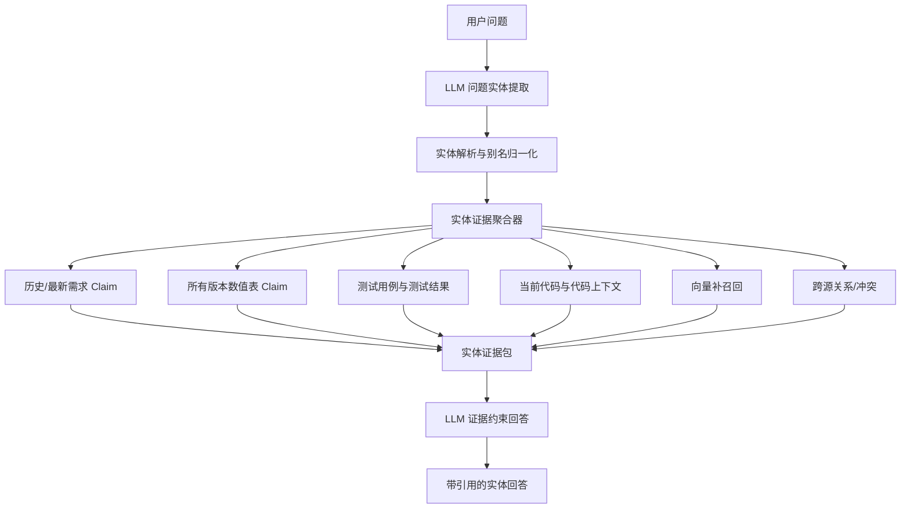

# 实体中心的多版本知识检索实现方案

> 目标：用户输入自然语言问题后，系统先由 LLM 提取实体和查询意图，再围绕实体查找所有相关版本的需求、数值表、测试、代码和证据，最后以当前代码实现和数值表为主要事实依据，由 LLM 生成带引用的回答。
>
> 本方案针对 NEXUS 现有 `knowledge/multisource`、代码检索、版本上下文、Claim/Evidence 和 Claim 向量投影能力设计，采用增量改造，不要求重写现有 RAG 链路。

## 1. 目标与原则

### 1.1 用户目标

用户不需要先选择版本，也不需要人工维护实体关系。用户可以直接问：

```text
角色达到 100 级时攻击力是多少？现在代码实际支持到多少？
```

系统应完成：

```text
问题
  -> LLM 提取实体、别名、意图和版本条件
  -> 解析实体到稳定 entityId
  -> 查询该实体所有版本的需求、参数、测试和代码关系
  -> 补充当前代码和当前数值表事实
  -> 分析冲突与实现偏差
  -> 把结构化证据交给 LLM
  -> 返回带引用的最终回答
```

### 1.2 事实原则

LLM 负责理解、提取、归一化和总结，但不能替代来源事实。

| 信息 | 主要回答的问题 | 当前事实权重 |
|---|---|---|
| `CODE` | 当前程序实际执行什么 | 行为事实最高 |
| `PARAMETER_TABLE` | 当前业务数值/配置是什么 | 数值事实最高 |
| `TEST_RESULT` | 当前实现是否被验证 | 验证事实 |
| `REQUIREMENT` | 应该实现什么、历史上要求过什么 | 目标和变更历史 |
| `TEST_CASE` | 应该如何验证 | 验证意图 |
| `DOUBT` | 哪些内容尚未确认 | 风险和待办 |
| 向量相似结果 | 哪些内容可能相关 | 只能作为召回线索 |

规则：

1. 问“代码现在怎么做”时，以当前代码证据为准。
2. 问“当前数值是多少”时，以当前有效数值表为准。
3. 代码和数值表冲突时，不能静默覆盖，必须报告实现偏差。
4. 最新需求不能覆盖当前代码事实；它只能说明目标或变更要求。
5. 历史需求不能被删除；它们用于解释实体的演进过程。
6. 每个最终结论必须绑定来源证据。没有证据时返回“无法确定”。

### 1.3 非目标

本方案不做以下事情：

- 不让 LLM 直接修改代码、数值表或需求。
- 不用向量分数决定哪个事实正确。
- 不把所有来源强行写入一个 Qdrant 集合。
- 不把历史需求和当前代码拼成一段无来源的综合文本。
- 不把“LLM 认为相似”当成已确认的实体合并关系。
- 不要求人工逐条维护几十万条 Claim 的实体归属。

## 2. 当前实现与目标实现

### 2.1 当前实现

当前多源入口是：

```http
POST /api/knowledge/multi-source/search
```

请求需要先给出：

```json
{
  "projectId": "immortal",
  "version": "5.1",
  "query": "攻击力"
}
```

当前链路大致是：

```text
projectId + version + query
  -> 意图分类
  -> 来源白名单
  -> 参数/测试/存疑结构化读取
  -> 需求图、代码、语义候选适配器
  -> Claim 向量候选和融合
  -> 状态门禁、冲突分析、分页
  -> claims/evidence/conflicts/relations
```

项目已有可复用能力：

- `KnowledgeClaimRecord`：统一 Claim 主记录。
- `MultiSourceKnowledgeStore`：Claim、Evidence、业务来源和关系的权威存储。
- `BusinessConceptService`：业务概念、别名和跨版本成员的现有雏形。
- `business_concept_member`：成员记录已包含 `business_version`、`truth_role`、`claim_id`、`commit_sha`。
- `CodeKnowledgeCandidateAdapter`：代码检索候选适配器。
- `VersionContextService`：项目/业务版本与代码提交上下文。
- `ClaimVectorCandidateAdapter`：Claim 向量语义补召回。
- `MultiSourceConflictAnalyzer`：按事实键和来源分析冲突。
- `ChatClient`：项目已有 LLM 调用能力。

### 2.2 关键差异

| 维度 | 当前实现 | 目标实现 |
|---|---|---|
| 主索引 | 业务版本 | 稳定实体 `entityId` |
| 用户输入 | 必须给版本 | 版本可选，从问题中解析 |
| 版本 | 查询前过滤条件 | 实体结果中的时间轴维度 |
| 实体 | 多数按版本/来源构建 | 跨版本、跨来源统一实体 |
| 代码 | 普通候选，未始终绑定 commit | 当前事实强制参与，绑定代码上下文 |
| 数值表 | 当前版本结构化读取 | 作为当前数值事实强制参与 |
| 向量 | 当前版本 Claim 的语义补召回 | 实体发现和相关 Claim 的补召回 |
| 冲突 | 当前候选集的值比较 | 实体时间轴 + 当前代码/数值表的实现偏差 |
| AI | 现有多源接口主要返回证据 | 基于结构化证据包生成回答 |

## 3. 总体架构



核心分层：

```text
权威事实层：SQLite Claim / 参数表 / 测试结果 / 代码索引与 commit
对齐层：实体、别名、Claim 成员、代码符号、跨源关系
召回层：精确实体、关键词、向量、局部图扩展
解释层：事实优先级、版本时间轴、冲突和实现偏差
生成层：LLM 基于证据包输出答案
```

## 4. 领域模型

### 4.1 稳定实体

实体 ID 不包含业务版本和来源类型：

```text
entity:immortal:attack-power
entity:immortal:role-level
entity:immortal:critical-damage-multiplier
```

实体表示跨版本稳定的业务对象、属性、模块、配置项或代码概念。

建议实体模型：

```java
public record CanonicalEntity(
        String entityId,
        String projectId,
        String canonicalName,
        String entityType,
        String description,
        EntityStatus status,
        double confidence,
        String createdAt,
        String updatedAt
) {}
```

实体不能因为来源不同而拆成多个实体。以下内容应尽量归到同一个实体：

```text
“攻击力”
“攻击属性”
“角色攻击”
“attack”
“attackPower”
```

但“攻击力上限”和“攻击力成长公式”不应仅因名称相似而自动合并。它们可以是两个实体，通过关系连接。

### 4.2 别名

```java
public record EntityAlias(
        String entityId,
        String alias,
        String sourceType,
        AliasOrigin origin,
        double confidence,
        AliasStatus status,
        List<String> evidenceIds
) {}
```

`origin`：

```text
SOURCE_EXPLICIT       来源中明确出现
RULE_NORMALIZED       规则归一化
LLM_PROPOSED          LLM 提议
HUMAN_CONFIRMED       人工确认
```

LLM 提议的别名默认不能直接成为高置信全局别名。系统应根据：

- 规范化名称是否相同。
- 是否出现在同一个 fact key 或同一模块。
- 是否有跨源关系支持。
- 是否有代码符号、参数列名或 Evidence 支持。
- 是否与已有实体产生数值和关系冲突。

决定自动接受、低置信接受或待审核。

### 4.3 实体成员

现有 `business_concept_member` 已接近这个模型，应优先扩展而不是另建重复表：

```text
business_concept
  -> 稳定 entityId / canonicalKey / displayName

business_concept_alias
  -> entityId / alias / source / confidence

business_concept_member
  -> entityId / claimId 或 code symbol / businessVersion
  -> sourceType / truthRole / commitSha / evidenceId
```

建议将当前概念模型收敛为：

```text
一个 BusinessConcept = 一个跨版本实体
一个 ConceptMember = 一个版本中的一条来源事实或代码证据
```

现有 `BusinessConceptService.build(projectId, version)` 需要增加项目级增量构建入口：

```java
BuildResult buildProject(String projectId);
BuildResult buildVersion(String projectId, String businessVersion);
```

`buildVersion` 只增量更新该版本成员；`buildProject` 负责重新计算实体候选、别名和跨版本合并，但不删除未被本次输入覆盖的历史成员。

### 4.4 实体关系

关系必须保留来源和证据：

```text
SUPPORTS       参数支撑需求
VERIFIES       测试验证需求
IMPLEMENTED_BY 需求/参数由代码实现
RAISES_DOUBT   存疑指向事实
SUPERSEDES     新需求替代旧需求
REFINES        新需求细化旧需求
REPEALS        新需求废止旧需求
SAME_FACT      跨来源表达同一事实
RELATED_TO     语义相关但不代表同一事实
```

`SUPERSEDES`、`REFINES`、`REPEALS` 不能只由版本号推断。可以由 LLM 提议，但必须记录：

```json
{
  "relationType": "SUPERSEDES",
  "sourceClaimId": "claim-new",
  "targetClaimId": "claim-old",
  "matchMethod": "LLM_PROPOSED",
  "confidence": 0.88,
  "evidenceIds": ["ev-1", "ev-2"],
  "status": "PROPOSED"
}
```

## 5. 存储设计

### 5.1 推荐复用现有表

第一阶段不新增一套平行的 `knowledge_entity_*` 表，优先复用：

```text
business_concept
business_concept_alias
business_concept_member
knowledge_claim
knowledge_claim_evidence
knowledge_document_version
version_context
alignment_relation
```

需要补充的字段或约束：

```text
business_concept.canonical_key
business_concept.status
business_concept.confidence
business_concept.updated_at

business_concept_alias.origin
business_concept_alias.status
business_concept_alias.evidence_ids

business_concept_member.claim_id
business_concept_member.business_version
business_concept_member.truth_role
business_concept_member.commit_sha
business_concept_member.evidence_id
```

如果现有数据库迁移成本较高，可以把 `origin/status/evidence_ids` 作为后续迁移字段，第一版暂时使用 `normalization_method`、`confidence` 和单个 `evidence_id` 表达。

### 5.2 实体查询索引

增加以下索引：

```sql
create index if not exists idx_concept_alias_lookup
  on business_concept_alias(project_id, alias);

create index if not exists idx_concept_member_entity_version
  on business_concept_member(project_id, concept_id, business_version);

create index if not exists idx_concept_member_claim
  on business_concept_member(project_id, claim_id);

create index if not exists idx_claim_fact_subject
  on knowledge_claim(project_id, fact_key, subject, predicate);

create index if not exists idx_document_version_business_status
  on knowledge_document_version(project_id, business_version, status);
```

### 5.3 关系和历史

历史 Claim 不删除。应使用 Claim 关系或生效区间表达演进：

```text
旧 Claim --SUPERSEDES/REPEALS--> 新 Claim
```

或：

```text
effective_from = 5.0
effective_to   = 5.1
```

两者含义不同：

- `SUPERSEDES` 表示明确的变更关系。
- `effective_from/effective_to` 表示适用时间范围。
- 只有版本号不同，不足以证明两个 Claim 互相替代。

## 6. 来源处理与 LLM 提取

### 6.1 先用确定性解析保留原始事实

每个来源先由现有解析器提取结构化记录：

```text
需求文档 -> 文档版本、Evidence、Requirement Claim
Excel     -> Sheet、行号、列名、参数值、单位、Parameter Claim
测试代码  -> 测试用例、预期值、测试 Evidence
测试结果  -> 执行状态、实际值、执行时间
代码      -> repository、commit、文件、符号、行号、代码文本
```

规则解析器必须先保存原始位置和来源 ID，再调用 LLM。LLM 失败时，不能丢失已经保存的结构化事实。

### 6.2 LLM 来源提取输出

LLM 只输出结构化候选，不直接写权威表：

```json
{
  "entities": [
    {
      "name": "角色等级",
      "aliases": ["等级", "level", "roleLevel"],
      "type": "ATTRIBUTE",
      "description": "角色成长系统中的等级属性",
      "confidence": 0.94
    }
  ],
  "facts": [
    {
      "entityName": "角色等级",
      "predicate": "maxLevel",
      "value": "120",
      "unit": null,
      "sourceClaimId": "claim-123",
      "confidence": 0.91
    }
  ],
  "relations": [
    {
      "sourceEntityName": "角色等级",
      "targetName": "RoleLevelValidator",
      "relationType": "IMPLEMENTED_BY",
      "confidence": 0.86
    }
  ]
}
```

系统校验：

1. `sourceClaimId` 必须真实存在。
2. `evidenceId` 必须属于同一项目和文档版本。
3. 参数值和单位必须通过结构化解析器校验。
4. 代码文件和行号必须来自代码索引，不接受模型伪造的位置。
5. 关系两端必须能够解析到实体或代码符号。
6. LLM 输出的值不能覆盖来源记录的原始值。

### 6.3 三类提取 Prompt 的边界

需求 Prompt 关注：

```text
实体、行为要求、约束、目标值、版本变化、替代关系
```

数值表 Prompt 关注：

```text
参数名、模块、值、范围、单位、精度、生效版本、Sheet、行号
```

代码 Prompt 关注：

```text
配置读取、默认值、边界判断、分支条件、计算公式、返回值、调用关系
```

代码抽取结果必须区分：

```text
代码中明确出现的常量
代码中读取的配置项
由控制流推导出的行为
LLM 对行为的解释
```

其中只有前三者可以作为代码证据，第四者只能作为解释候选。

## 7. 问题实体提取与解析

### 7.1 问题分析模型

```java
public record EntityQueryPlan(
        String projectId,
        String originalQuery,
        List<EntityMention> mentions,
        QueryIntent intent,
        List<String> requestedVersions,
        boolean includeHistory,
        boolean asksCurrentState,
        boolean asksImplementation,
        boolean asksNumericValue
) {}
```

例如：

```text
问题：角色达到100级时攻击力是多少？现在代码实际支持到多少？

实体：角色、等级、攻击力
意图：CURRENT_STATE + NUMERIC_VALUE + IMPLEMENTATION
版本：未指定
历史：由“现在”与“多少”推断需要当前事实，同时保留相关历史
```

### 7.2 解析顺序

实体解析必须按以下顺序执行：

```text
1. 规范化名称精确匹配
2. 已确认别名匹配
3. 业务概念成员名称匹配
4. factKey / subject / predicate / 参数列名匹配
5. 代码符号和配置键匹配
6. Claim 向量召回候选实体
7. LLM 在候选 entityId 中做受限选择
8. 仍不确定时返回多个候选并标记 NEEDS_REVIEW
```

LLM 只能从系统提供的候选中选实体，不能直接返回一个未经注册的实体 ID。

### 7.3 多实体问题

如果问题包含多个实体：

```text
“角色等级上限和攻击力成长公式是否和当前代码一致？”
```

应分别解析：

```text
entity:role-level
entity:attack-power-growth
```

然后建立问题级关系：

```text
role-level --AFFECTS--> attack-power-growth
```

关系可以由现有结构化 fact key、代码调用关系和 LLM 候选共同产生，但必须保留置信度和证据。

## 8. 实体证据聚合

### 8.1 查询接口

新增实体中心接口：

```http
POST /api/knowledge/entity-search
```

请求：

```json
{
  "projectId": "immortal",
  "query": "角色达到100级时攻击力是多少？现在代码实际支持到多少？",
  "versions": [],
  "includeHistory": true,
  "includeCode": true,
  "includeParameters": true,
  "includeTests": true,
  "limit": 50
}
```

`versions` 为空表示所有相关版本；填写版本表示缩小时间轴范围，而不是改变实体解析逻辑。

### 8.2 证据聚合服务

新增：

```text
EntityQueryService
EntityResolver
EntityEvidenceAggregator
EntityFactPriorityService
KnowledgeAnswerService
```

推荐调用关系：

```text
EntityQueryController
  -> EntityQueryService
      -> EntityQueryPlanner
      -> EntityResolver
      -> EntityEvidenceAggregator
          -> MultiSourceKnowledgeStore
          -> CodeKnowledgeService
          -> VersionContextService
          -> ClaimVectorCandidateAdapter（可选）
      -> EntityFactPriorityService
      -> KnowledgeAnswerService（可选生成回答）
```

### 8.3 聚合查询内容

对于每个解析到的实体，聚合：

```text
1. 所有版本的需求 Claim
2. 所有版本的参数表 Claim
3. 所有版本的测试用例
4. 所有版本的测试结果
5. 当前代码上下文和代码 Evidence
6. 历史代码上下文（用户明确要求版本对比时）
7. 实体别名
8. Claim-Evidence 关系
9. 跨源关系
10. 同一 fact key 的冲突
11. Claim 的生效区间和 supersedes 关系
```

代码默认取当前版本上下文中的 commit；如果没有显式当前上下文，应返回：

```text
CODE_CONTEXT_UNAVAILABLE
```

不能把任意最新索引结果伪装成当前代码事实。

### 8.4 响应模型

```json
{
  "query": "...",
  "plan": {
    "intent": "CURRENT_STATE",
    "mentions": [
      {
        "text": "攻击力",
        "entityId": "entity:attack-power",
        "confidence": 0.96
      }
    ]
  },
  "entities": [
    {
      "entityId": "entity:attack-power",
      "canonicalName": "攻击力",
      "aliases": ["攻击力", "attackPower"],
      "currentFacts": {
        "code": [],
        "parameterTables": [],
        "testResults": []
      },
      "timeline": [
        {
          "businessVersion": "5.0",
          "requirements": [],
          "parameterTables": [],
          "tests": []
        },
        {
          "businessVersion": "5.1",
          "requirements": [],
          "parameterTables": [],
          "tests": []
        }
      ],
      "relations": [],
      "conflicts": [],
      "warnings": []
    }
  ],
  "factAssessment": {
    "currentBehavior": [],
    "currentValues": [],
    "validation": [],
    "requirementTarget": [],
    "implementationGaps": []
  },
  "citations": []
}
```

`timeline` 负责完整历史，`currentFacts` 负责当前事实，不允许把两者混成一个数组后再让 LLM 自己猜。

## 9. 事实优先级与冲突判断

### 9.1 按问题类型选择事实视图

```text
当前行为：CODE > TEST_RESULT > PARAMETER_TABLE > REQUIREMENT
当前数值：PARAMETER_TABLE > CODE > TEST_RESULT > REQUIREMENT
是否实现：CODE + TEST_RESULT 对比 REQUIREMENT/PARAMETER_TABLE
需求演进：最新有效 REQUIREMENT + 历史 SUPERSEDES 链
```

这里的 `>` 不是删除低优先级来源，而是决定当前结论的主证据。

### 9.2 代码与数值表冲突

示例：

```text
需求：等级上限 120
数值表：等级上限 120
代码：level > 100 时拒绝
测试：等级 120 失败
```

事实评估应输出：

```json
{
  "currentBehavior": {
    "value": "100",
    "sourceType": "CODE",
    "status": "SUPPORTED"
  },
  "currentValues": {
    "value": "120",
    "sourceType": "PARAMETER_TABLE",
    "status": "SUPPORTED"
  },
  "validation": {
    "value": "120 级测试失败",
    "sourceType": "TEST_RESULT",
    "status": "REVIEW_REQUIRED"
  },
  "implementationGap": {
    "type": "CODE_PARAMETER_MISMATCH",
    "status": "CONFLICTED"
  }
}
```

最终回答：

```text
当前代码实际限制为 100，证据为 RoleLevelValidator.java:42。
5.1 数值表配置为 120，证据为 RoleConfig.xlsx / Sheet=Role / Row=18。
120 级测试当前失败。
因此系统当前实际支持 100，但目标配置已经是 120，代码尚未实现数值表要求。
```

### 9.3 冲突不自动仲裁来源

冲突分析器可以判断：

```text
值是否不同
factKey 是否一致
单位是否一致
是否同一实体
是否同一版本
是否存在测试失败
是否存在代码实现关系
```

但不能自动执行：

```text
把代码改成数值表的值
把最新需求标为正确事实
删除历史需求
将两个实体强制合并
```

## 10. 向量投影在实体中心架构中的位置

### 10.1 保留向量，但降级职责

向量投影是可重建的召回索引，职责是：

```text
1. 用户问题措辞与实体名称不一致时，发现候选实体
2. 精确字段没有命中时，补充相关 Claim
3. 发现可能关联的历史需求、参数或测试
```

向量不能决定：

```text
哪个版本当前生效
哪个值正确
代码是否实现需求
两个实体是否一定相同
最终答案是什么
```

### 10.2 推荐检索顺序

```text
问题
  -> 精确/别名实体匹配
  -> 命中实体后查询所有版本结构化成员
  -> 强制查询当前参数表和代码上下文
  -> 查询测试及跨源关系
  -> 向量补召回未命中的 Claim/实体
  -> 冲突和事实优先级分析
  -> LLM 回答
```

### 10.3 向量集合范围

不要为了实现跨版本实体查询而把代码、测试结果、需求和参数表全部混成一个集合。

推荐：

```text
Claim 向量：需求、参数、测试用例、存疑
代码索引：代码块、符号、配置、commit
SQLite：参数结构化值、测试结果、Evidence、关系和实体成员
```

Claim 向量点必须保留：

```text
projectId
businessVersion
claimId
documentVersionId
entityId（解析完成后）
sourceType
projectionGenerationId
```

当实体查询跨多个业务版本时，可以：

1. 查询各版本 active vector generation；或
2. 增加项目级历史 Claim collection；或
3. 第一阶段仅通过 SQLite 实体成员做跨版本聚合，向量只负责问题实体发现。

推荐先采用第 3 种，避免在实体模型未稳定前扩大 Qdrant 迁移范围。

## 11. LLM 回答层

### 11.1 新增服务

```text
KnowledgeAnswerService.answer(EntityEvidenceResponse response)
```

LLM 输入不是整库文本，而是经过限制的证据包：

```text
[CURRENT_CODE]
[CURRENT_PARAMETER_TABLE]
[TEST_RESULT]
[LATEST_REQUIREMENT]
[HISTORICAL_REQUIREMENT]
[RELATIONS]
[CONFLICTS]
[WARNINGS]
```

### 11.2 系统 Prompt 约束

```text
你只能基于提供的证据回答。
当前行为优先引用 CURRENT_CODE。
当前数值优先引用 CURRENT_PARAMETER_TABLE。
TEST_RESULT 只说明验证是否通过，不能单独推导未执行的行为。
REQUIREMENT 用于说明目标和历史，不得覆盖当前代码事实。
代码与数值表不一致时，必须同时报告两者和实现偏差。
每个关键结论必须附证据 ID。
没有足够证据时回答无法确定，并指出缺失的来源。
不得把相似文本、LLM 推测或未确认关系写成确定事实。
```

### 11.3 输出模型

```json
{
  "answer": "当前代码实际限制为 100，数值表配置为 120，120 级测试失败，因此存在实现偏差。",
  "sections": [
    {
      "title": "当前实际行为",
      "text": "...",
      "evidenceIds": ["code-ev-1"]
    },
    {
      "title": "当前数值表",
      "text": "...",
      "evidenceIds": ["table-ev-1"]
    },
    {
      "title": "历史需求演进",
      "text": "...",
      "evidenceIds": ["req-ev-1", "req-ev-2"]
    },
    {
      "title": "结论",
      "text": "...",
      "evidenceIds": ["code-ev-1", "table-ev-1", "test-ev-1"]
    }
  ],
  "status": "REVIEW_REQUIRED",
  "citationQuality": "VERIFIED"
}
```

复用现有 Evidence Registry 约束：模型返回的 Evidence ID 必须经过服务端校验，不能直接信任模型输出。

## 12. API 与前端改造

### 12.1 API

新增：

```http
POST /api/knowledge/entity-search
```

可选新增只检索接口：

```http
POST /api/knowledge/entity-search/evidence
```

以及最终回答接口：

```http
POST /api/knowledge/entity-answer
```

第一阶段可以只实现一个接口，在响应中同时返回证据包和可选 AI 答案；第二阶段拆分检索和生成，便于缓存、评测和重试。

### 12.2 前端展示

页面不应只展示混合 Claim 列表，建议按实体分组：

```text
实体：攻击力

当前实际行为
  代码实现、commit、文件、行号

当前数值
  参数表、Sheet、行号、值、单位

测试验证
  测试用例、实际结果、执行时间

需求时间轴
  历史需求 -> 最新需求 -> 替代/细化关系

冲突与实现偏差
  代码值 vs 数值表值

AI 结论
  结论文本 + Evidence 引用
```

当用户没有指定版本时，版本选择控件应为“全部相关版本”，而不是强制用户选择一个版本。

## 13. 与 LightRAG 的关系

LightRAG 适合借鉴的思想：

```text
文本 -> 实体/关系 -> 图和向量索引
问题 -> 实体识别 -> 局部图检索 + 向量检索
实体、关系、文本证据 -> LLM 生成回答
```

本方案借鉴：

1. 从问题中抽取实体。
2. 通过实体做局部图扩展。
3. 用向量补充语义召回。
4. 把实体、关系和 Evidence 组织成 LLM 上下文。

本方案与 LightRAG 的关键差异：

| 方面 | LightRAG 思路 | 本方案 |
|---|---|---|
| 实体来源 | 以 LLM 抽取为主 | LLM 提议 + 规则/来源校验 |
| 事实权威 | 主要由上下文交给 LLM 判断 | 代码和数值表有明确事实角色 |
| 版本 | 通常不是核心发布模型 | 实体下保留所有版本时间轴 |
| 代码 | 可作为文本/实体来源 | 当前 commit 是独立实现事实 |
| 数值 | 可能只是文本内容 | 参数表保留结构化值、单位和行号 |
| 冲突 | 依赖检索上下文和 LLM | 确定性 fact key + 来源优先级 + 实现偏差 |
| 审计 | 依赖 chunk/source 引用 | Claim/Evidence/commit/Sheet 级引用 |
| 图谱状态 | LLM 生成关系可直接进入图 | 关系有 PROPOSED/CONFIRMED/REJECTED 生命周期 |

因此不应直接把 LightRAG 的 LLM 图谱当作事实库。正确组合是：

```text
LightRAG 的实体/局部图/混合召回
+
NEXUS 的 Claim、Evidence、版本上下文、代码索引、参数结构化数据
+
代码和数值表优先的事实评估
```

参考：

- [LightRAG GitHub](https://github.com/HKUDS/LightRAG)
- [LightRAG 论文](https://arxiv.org/html/2410.05779v2)

## 14. 分阶段实施计划

### Phase 1：跨版本实体基础

目标：同一个实体能够关联所有版本的已有 Claim。

任务：

1. 明确 `BusinessConcept` 作为跨版本实体的语义。
2. 去除 `param:`、`req:`、`test:` 前缀导致的错误拆分，改为实体类型和成员角色。
3. 增加项目级概念重建和版本增量构建。
4. 保留历史成员，不因一次版本构建删除其他版本成员。
5. 增加实体/别名/成员索引。
6. 为实体成员补齐 Claim 和 Evidence 校验。

验收：

- 同一实体在两个业务版本下返回同一个 `entityId`。
- 参数、需求和测试成员可以同时挂到同一实体。
- 历史成员不会因重新导入最新版本而消失。

### Phase 2：LLM 实体提取与归一化

目标：从来源和用户问题自动识别实体。

任务：

1. 增加来源级实体提取器。
2. 增加问题实体提取器。
3. 增加候选实体受限选择 Prompt。
4. 增加 LLM 提议关系的状态和 Evidence。
5. 增加 JSON Schema/Java record 校验。
6. 对低置信度合并返回 `NEEDS_REVIEW`。

验收：

- 用户问题中的实体能匹配已有 entityId。
- 未命中时能返回候选实体而不是伪造 ID。
- LLM 失败时精确实体检索仍然可用。

### Phase 3：实体中心证据查询

目标：用户不选版本也能获取实体全时间轴。

任务：

1. 新增 `EntityQueryService`。
2. 新增 `/api/knowledge/entity-search`。
3. 按实体聚合所有版本 Claim、参数、测试、Evidence 和关系。
4. 强制加载当前参数表和当前代码上下文。
5. 缺少代码或数值表时返回稳定告警。
6. 增加分页和证据数量上限，避免一次把全量 Claim 返回给前端。

验收：

- 查询一个实体能看到所有相关版本。
- 当前代码和数值表始终出现在 `currentFacts`。
- 结果可定位到代码 commit/文件行号和 Sheet/行号。

### Phase 4：事实优先级和实现偏差

目标：系统能区分“要求是什么”和“现在实际是什么”。

任务：

1. 增加 `EntityFactPriorityService`。
2. 实现代码/数值表/测试/需求的分区视图。
3. 扩展冲突分析到实体时间轴。
4. 增加 `CODE_PARAMETER_MISMATCH`、`REQUIREMENT_IMPLEMENTATION_GAP` 等稳定类型。
5. 不自动修改任何来源事实。

验收：

- 代码值与数值表值不同时，结果明确标记冲突。
- 最新需求不会覆盖代码事实。
- 历史需求能按时间轴展示并保留替代关系。

### Phase 5：AI 带证据回答

目标：LLM 基于实体证据包生成可审计回答。

任务：

1. 新增 `KnowledgeAnswerService`。
2. 复用 Evidence Registry 校验模型引用。
3. 实现事实区分 Prompt。
4. 输出 `answer/status/sections/evidenceIds`。
5. 记录模型、Prompt 版本、实体解析结果和证据快照。
6. 增加无证据、冲突、代码缺失、参数表缺失的回答模板。

验收：

- 关键结论都有有效引用。
- 代码与数值表冲突时，回答同时展示两者。
- 模型无法判断时不会编造结论。

### Phase 6：LightRAG 式局部图和向量优化

目标：提升实体发现和关联信息召回，不改变事实权威。

任务：

1. 查询实体的一跳/两跳关系。
2. 将向量候选映射回实体和 Claim。
3. 评估项目级历史 Claim collection 的必要性。
4. 增加实体召回、关系召回和历史覆盖率指标。
5. 只在评测证明收益后扩大向量索引范围。

## 15. 测试与质量门

### 15.1 单元测试

- 同义词、大小写、中文空格和代码命名归一化。
- 同一实体跨版本合并。
- 不同 fact key 不被错误合并。
- LLM 输出缺字段、非法 Claim ID、非法 Evidence ID。
- 数值单位、范围和精度校验。
- `CODE`、`PARAMETER_TABLE`、`TEST_RESULT` 的事实角色。
- 代码/数值表冲突分类。
- 历史 Claim 和替代关系保留。

### 15.2 集成测试

```text
问题 -> 实体提取 -> 实体解析 -> 全版本聚合 -> 当前代码/参数补充
```

必须覆盖：

1. 只命中实体别名。
2. 同一实体有多个业务版本。
3. 最新需求与历史需求值不同。
4. 数值表与代码实现不同。
5. 代码索引不可用。
6. 参数表没有当前有效记录。
7. 向量服务不可用但精确实体可用。
8. LLM 不可用但规则解析可用。
9. 多实体问题。
10. 返回证据 ID 无法通过 Registry 校验。

### 15.3 评测指标

```text
实体识别准确率
实体归一化准确率
跨版本覆盖率
代码证据命中率
参数表证据命中率
测试结果覆盖率
错误实体合并率
跨项目/跨版本泄漏率
冲突召回率
无证据幻觉率
引用有效率
```

质量门：

```text
跨项目泄漏 = 0
错误版本泄漏 = 0
无 Evidence 的确定结论 = 0
代码/参数冲突静默丢失 = 0
无来源的 LLM 实体自动落库 = 0
```

## 16. 最小可用落地顺序

如果要尽快让用户使用，建议先做以下最小闭环：

```text
1. 复用 business_concept/member 做跨版本实体成员
2. 增加项目级实体查询
3. 允许问题中无 version
4. 规则优先、LLM 辅助提取问题实体
5. 强制加载当前参数表和当前代码
6. 返回实体时间轴和事实分区
7. 暂时不把代码和测试结果加入 Claim 向量
8. 最后接入 LLM 生成带引用回答
```

第一版可以先支持：

```http
POST /api/knowledge/entity-search
```

返回结构化证据，不立即改变现有 `/api/knowledge/multi-source/search` 的行为。待实体检索评测通过后，再让前端默认从实体中心入口调用。

## 17. 最终数据流示例

```text
问题：
“角色达到100级时攻击力是多少？现在代码实际支持到多少？”

提取实体：
角色、等级、攻击力

解析实体：
entity:role-level
entity:attack-power

聚合：
5.0 需求：等级上限 100
5.1 需求：等级上限 120
5.1 数值表：等级上限 120
当前代码：RoleLevelValidator.java:42 限制 100
测试结果：Level120Test 失败

事实判断：
当前代码行为 = 100
当前数值表 = 120
需求目标 = 120
验证结果 = 120 未通过

AI 回答：
当前系统代码实际支持到 100 级；5.1 数值表和最新需求要求 120 级，
但 120 级测试失败，因此代码尚未实现当前数值表和需求目标。

引用：
代码文件/行号、Excel Sheet/行号、测试用例和测试结果、需求版本。
```

最终原则：

> **实体是跨版本检索的主索引；版本是实体的时间轴；代码和数值表定义当前事实；测试验证当前事实；需求解释目标和历史；向量负责补召回；LLM 负责提取、关联和基于证据总结。**
