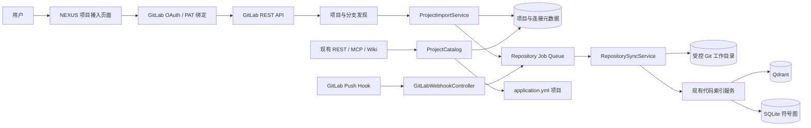
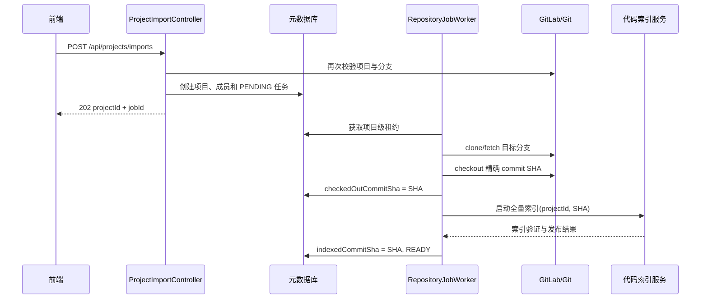
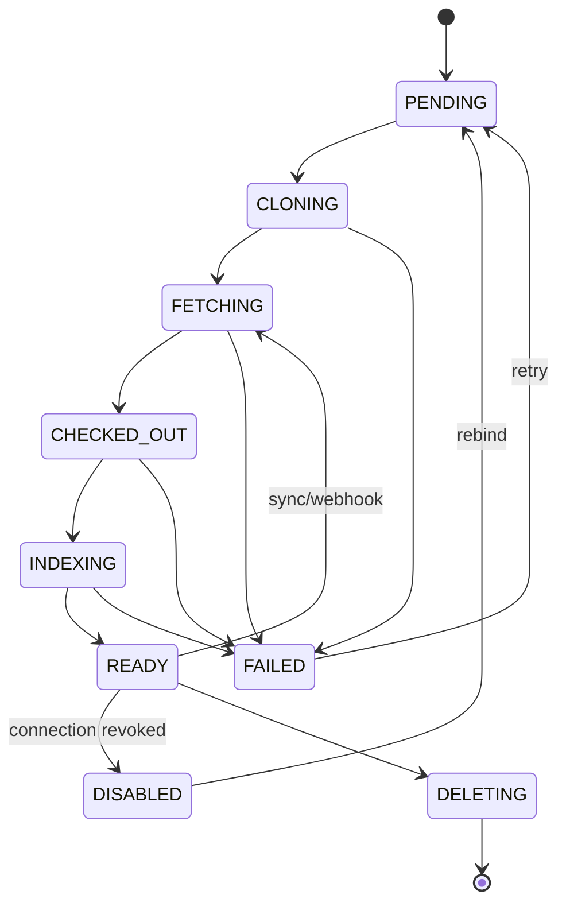

# NEXUS GitLab 项目接入实现方案

> 状态：Draft
> 目标版本：0.9
> 编写日期：2026-08-17
> 适用范围：GitLab.com 与 GitLab Self-Managed

## 1. 背景

NEXUS 当前已经具备多项目隔离、项目权限校验、代码全量/增量索引、Git
diff、GitLab webhook 入口和按 `projectId` 隔离的 Qdrant/符号图能力，但项目仍主要
通过 `application.yml` 静态注册，代码仓库也需要预先存在于服务端本地或挂载目录。

本方案将项目接入升级为以下自助流程：

1. 用户绑定 GitLab。
2. NEXUS 读取该用户有权访问的项目。
3. 用户选择 GitLab 项目和分支。
4. NEXUS 创建内部项目并在受控目录 clone/fetch。
5. 后台任务在精确 commit 上执行代码索引。
6. GitLab push webhook 触发后续增量同步与索引。

## 2. 目标与非目标

### 2.1 目标

- 支持用户从 GitLab 项目列表中选择并导入项目。
- 同时支持 GitLab.com 和管理员允许的 GitLab Self-Managed 实例。
- 保留当前 `application.yml` 静态项目，确保现有部署平滑迁移。
- 将 GitLab 外部项目 ID 与 NEXUS 内部 `projectId` 解耦。
- 仓库同步、索引和 webhook 处理可重试、可观测、可审计。
- 所有查询继续使用现有 `projectId`、权限守卫和 collection 隔离机制。
- 索引结果始终绑定确定的 Git commit SHA。
- 凭据、仓库路径和 webhook 入口满足最小权限与服务端安全约束。

### 2.2 非目标

- 不把 NEXUS 仓库目录作为开发者工作副本或 push 目标。
- 不在首期实现 GitLab 写操作、Merge Request 创建或代码提交。
- 不允许用户指定任意服务端本地路径。
- 不在首期支持同一 NEXUS 项目同时聚合多个 Git 仓库。
- 不在首期替换现有检索、Wiki、版本知识和符号图实现。

## 3. 当前能力与缺口

### 3.1 可复用能力

| 能力 | 当前实现 | 接入后的用途 |
|---|---|---|
| 静态项目注册 | `ProjectRegistry` | 作为兼容数据源保留 |
| 项目访问校验 | `ProjectAccessGuard`、`ProjectAuthorizationService` | 保护导入后的项目 |
| 项目参数解析 | `ProjectIdResolver` | 保持 API 的 `projectId` 契约 |
| Git 版本差异 | `GitDiffService` | 增量索引、版本差异和 Wiki 失效传播 |
| 全量/增量索引 | Code Index API 与索引服务 | 导入和 push 后的索引执行器 |
| 项目级存储隔离 | Qdrant collection、SQLite 图快照 | 动态项目的数据隔离 |
| GitLab webhook | `/api/webhooks/gitlab` | 改造成按动态项目路由 |

### 3.2 核心缺口

- 没有 GitLab OAuth 或用户级访问令牌绑定。
- 没有读取用户可访问 GitLab 项目的客户端。
- 项目注册表只在启动时从配置构建，不能持久化动态项目。
- 没有服务端 clone/fetch、工作目录治理和项目同步状态机。
- 没有凭据加密存储、刷新、吊销和审计。
- webhook 目前缺少动态项目映射、项目级同步锁和完整幂等语义。
- 前端项目选择器只能选择已经配置的项目，不能发现或导入 GitLab 项目。

## 4. 总体架构



### 4.1 核心原则

1. **动态元数据入库**：不要把 GitLab 项目写回 `RagProperties` 或运行时修改全局
   `Map`。
2. **内部 ID 稳定**：所有业务链路继续使用 NEXUS `projectId`，GitLab numeric project
   ID 只用于外部映射。
3. **commit 一致性**：仓库同步成功不代表索引成功，只有索引发布后才更新
   `indexedCommitSha`。
4. **异步执行**：clone、fetch、checkout 和索引不占用 HTTP 请求线程。
5. **项目级串行**：同一项目的导入、手动同步、定时同步和 webhook 同一时间只允许
   一个任务修改工作目录或索引。
6. **兼容优先**：静态项目与动态项目通过统一只读接口供现有服务使用。

## 5. 领域模型与存储

建议首期使用 PostgreSQL；若 0.9 元数据迁移尚未完成，可先定义 Repository 接口并用
SQLite 实现，但表结构和状态契约保持一致。

### 5.1 `gitlab_connection`

| 字段 | 类型 | 说明 |
|---|---|---|
| `id` | UUID | 连接主键 |
| `owner_user_id` | VARCHAR | NEXUS 用户 ID |
| `base_url` | VARCHAR | GitLab 实例根地址 |
| `gitlab_user_id` | BIGINT | GitLab 用户数字 ID |
| `gitlab_username` | VARCHAR | 展示与审计使用 |
| `auth_type` | VARCHAR | `OAUTH` / `PERSONAL_ACCESS_TOKEN` |
| `access_token_ciphertext` | TEXT | 加密后的 access token |
| `refresh_token_ciphertext` | TEXT | 加密后的 refresh token，可空 |
| `token_expires_at` | TIMESTAMP | token 过期时间，可空 |
| `granted_scopes` | JSON/TEXT | 实际授权 scope |
| `status` | VARCHAR | `ACTIVE` / `EXPIRED` / `REVOKED` / `ERROR` |
| `last_verified_at` | TIMESTAMP | 最近一次连通性验证时间 |
| `created_at` | TIMESTAMP | 创建时间 |
| `updated_at` | TIMESTAMP | 更新时间 |

约束：

```text
UNIQUE(owner_user_id, base_url, gitlab_user_id)
```

### 5.2 `managed_project`

| 字段 | 类型 | 说明 |
|---|---|---|
| `id` | VARCHAR | NEXUS 内部 `projectId` |
| `display_name` | VARCHAR | 项目显示名 |
| `source_type` | VARCHAR | 首期固定为 `GITLAB` |
| `connection_id` | UUID | GitLab 连接 |
| `gitlab_project_id` | BIGINT | GitLab 项目数字 ID |
| `path_with_namespace` | VARCHAR | 如 `group/order-service` |
| `web_url` | VARCHAR | GitLab 项目页面 |
| `clone_url` | VARCHAR | 不含凭据的 HTTPS clone URL |
| `default_branch` | VARCHAR | GitLab 默认分支 |
| `selected_branch` | VARCHAR | NEXUS 跟踪分支 |
| `local_repository_path` | VARCHAR | 服务端生成的受控目录 |
| `code_collection` | VARCHAR | 代码 collection |
| `requirement_collection` | VARCHAR | 需求 collection |
| `sync_status` | VARCHAR | 仓库同步状态 |
| `index_status` | VARCHAR | 索引状态 |
| `remote_commit_sha` | CHAR(40/64) | 最近确认的远端 commit |
| `checked_out_commit_sha` | CHAR(40/64) | 当前工作目录 commit |
| `indexed_commit_sha` | CHAR(40/64) | 已发布索引对应 commit |
| `last_sync_job_id` | UUID | 最近同步任务 |
| `last_error_code` | VARCHAR | 稳定错误码 |
| `last_error_message` | TEXT | 脱敏后的错误摘要 |
| `created_by` | VARCHAR | 导入用户 |
| `created_at` | TIMESTAMP | 创建时间 |
| `updated_at` | TIMESTAMP | 更新时间 |

约束：

```text
UNIQUE(connection_id, gitlab_project_id, selected_branch)
UNIQUE(code_collection)
UNIQUE(requirement_collection)
```

`local_repository_path` 由服务端根据 `projectId` 生成，不接受客户端传值。

### 5.3 `project_membership`

| 字段 | 类型 | 说明 |
|---|---|---|
| `project_id` | VARCHAR | NEXUS 项目 ID |
| `user_id` | VARCHAR | NEXUS 用户 ID |
| `role` | VARCHAR | `OWNER` / `EDITOR` / `VIEWER` |
| `source` | VARCHAR | `IMPORTER` / `MANUAL` / `GITLAB_SYNC` |
| `created_at` | TIMESTAMP | 创建时间 |
| `updated_at` | TIMESTAMP | 更新时间 |

首期由导入者获得 `OWNER`。是否持续同步 GitLab 成员关系作为第二期能力，不能在首次
OAuth 后永久假定用户仍有 GitLab 权限。

### 5.4 `repository_job`

| 字段 | 类型 | 说明 |
|---|---|---|
| `id` | UUID | 任务 ID |
| `project_id` | VARCHAR | NEXUS 项目 ID |
| `trigger_type` | VARCHAR | `IMPORT` / `MANUAL` / `WEBHOOK` / `SCHEDULED` |
| `requested_commit_sha` | VARCHAR | 期望同步到的 commit |
| `before_commit_sha` | VARCHAR | 增量起点，可空 |
| `status` | VARCHAR | 任务状态 |
| `attempt` | INT | 当前重试次数 |
| `idempotency_key` | VARCHAR | 幂等键 |
| `started_at` | TIMESTAMP | 开始时间 |
| `finished_at` | TIMESTAMP | 结束时间 |
| `error_code` | VARCHAR | 稳定错误码 |
| `error_message` | TEXT | 脱敏错误摘要 |

建议幂等键：

```text
projectId + selectedBranch + requestedCommitSha + operation
```

## 6. 项目目录抽象

### 6.1 新增接口

```java
public interface ProjectCatalog {
    ProjectDefinition require(String projectId);
    Optional<ProjectDefinition> find(String projectId);
    List<ProjectDefinition> findAccessible(UserContext user);
    ProjectDefinition defaultProject();
}
```

`ProjectDefinition` 应是独立领域对象，不直接暴露持久化实体或
`RagProperties.ProjectConfig`。

建议实现：

```text
ProjectCatalog
└── CompositeProjectCatalog
    ├── ConfiguredProjectSource
    └── ManagedProjectSource
```

### 6.2 迁移策略

1. 从 `ProjectRegistry` 抽取 `ConfiguredProjectSource`。
2. `CompositeProjectCatalog` 先查询动态项目，再查询静态项目。
3. 动态项目 ID 与静态项目 ID 冲突时拒绝导入，不做静默覆盖。
4. 将 `ProjectAuthorizationService`、`ProjectIdResolver`、`GitDiffService` 和索引服务
   的依赖逐步从 `ProjectRegistry` 切换为 `ProjectCatalog`。
5. 保留 `ProjectRegistry` 适配器一个版本，降低一次性修改 20 余个调用点的风险。

## 7. GitLab 认证与项目发现

### 7.1 MVP：Personal Access Token

MVP 允许用户或管理员绑定 PAT，快速验证完整导入链路。

建议最小 scope：

- `read_api`：读取当前用户、项目和分支元数据。
- `read_repository`：读取私有仓库。

PAT 提交后后端立即调用 GitLab 用户 API 验证，不在后续响应中返回 token。

### 7.2 V2：OAuth Authorization Code + PKCE

流程：

1. `GET /api/integrations/gitlab/authorize` 生成 `state`、PKCE verifier/challenge。
2. 浏览器跳转 GitLab 授权页。
3. GitLab 回调 `GET /api/integrations/gitlab/callback`。
4. 后端校验 `state`，使用 code + verifier 换取 token。
5. 调用 GitLab 用户 API 获取用户身份并创建或更新 connection。
6. token 刷新失败时将连接标记为 `EXPIRED`，停止后台同步并提示重新绑定。

`state` 与 PKCE verifier 应短期存储且一次性消费，不能只依赖浏览器传回值。

### 7.3 GitLab 实例约束

- GitLab.com 使用预配置地址。
- Self-Managed 实例必须由管理员加入 host allowlist。
- 解析 URL 后禁止 loopback、link-local、私网地址和重定向到非白名单 host，除非管理员
  明确允许对应内网实例。
- 所有 GitLab API 请求设置连接、读取和总耗时超时。
- API client 统一处理分页、`429`、`Retry-After`、5xx 重试和 token 失效。

### 7.4 项目与分支发现

项目列表默认调用 GitLab Projects API：

```http
GET /api/v4/projects?membership=true&simple=true&order_by=last_activity_at&sort=desc
```

后端负责遍历或透传分页，不把 access token 暴露给浏览器。项目搜索使用 GitLab API
的 `search` 参数，不在 NEXUS 内拉取全量后再过滤。

选择项目后，再按项目数字 ID 获取分支：

```http
GET /api/v4/projects/{url_encoded_project_id}/repository/branches
```

客户端只能提交后端项目发现接口返回的 connection、GitLab project ID 和 branch；
导入服务需要再次向 GitLab 验证项目与分支，不能信任页面缓存。

## 8. REST API 设计

### 8.1 GitLab 连接

```text
POST   /api/integrations/gitlab/connections
GET    /api/integrations/gitlab/connections
DELETE /api/integrations/gitlab/connections/{connectionId}

GET    /api/integrations/gitlab/authorize
GET    /api/integrations/gitlab/callback
```

PAT 绑定请求：

```json
{
  "baseUrl": "https://gitlab.example.com",
  "personalAccessToken": "<write-only>"
}
```

响应中只返回连接元数据和脱敏状态：

```json
{
  "id": "connection-uuid",
  "baseUrl": "https://gitlab.example.com",
  "username": "alice",
  "authType": "PERSONAL_ACCESS_TOKEN",
  "status": "ACTIVE"
}
```

### 8.2 项目发现

```text
GET /api/integrations/gitlab/connections/{connectionId}/projects
GET /api/integrations/gitlab/connections/{connectionId}/projects/{gitlabProjectId}/branches
```

项目列表参数：

```text
search
page
perPage
```

响应必须保留分页信息，不把 GitLab 原始响应原样透传给前端。

### 8.3 项目导入与管理

```text
POST   /api/projects/imports
GET    /api/projects/imports/{jobId}
GET    /api/projects/{projectId}/repository-status
POST   /api/projects/{projectId}/sync
DELETE /api/projects/{projectId}
```

导入请求：

```json
{
  "connectionId": "connection-uuid",
  "gitlabProjectId": 12345,
  "branch": "main",
  "displayName": "Order Service"
}
```

返回 `202 Accepted`：

```json
{
  "projectId": "order-service-a17f2c",
  "jobId": "job-uuid",
  "status": "PENDING"
}
```

服务端生成 `projectId`，建议：

```text
slug(pathWithNamespace) + "-" + shortHash(baseUrl + gitlabProjectId)
```

生成后不可因 GitLab rename 或 group transfer 改变。

### 8.4 Webhook

建议新入口：

```text
POST /api/webhooks/gitlab/{projectId}
```

URL 中 `projectId` 仅用于初步路由，最终必须同时验证 payload 中的 GitLab numeric project
ID 与数据库记录一致。

## 9. 仓库同步与索引

### 9.1 受控工作目录

配置：

```yaml
app:
  repository-management:
    workspace-root: /var/lib/nexus/repositories
    max-repository-bytes: 2147483648
    clone-timeout: 10m
    fetch-timeout: 3m
    max-concurrent-jobs: 4
```

目录由服务端生成：

```text
<workspace-root>/<projectId>/repo
```

执行前后都需要校验规范化路径仍位于 `workspace-root` 下，并拒绝符号链接逃逸。

### 9.2 首次导入流程



### 9.3 Git 凭据注入

禁止：

```text
https://oauth2:<token>@gitlab.example.com/group/repo.git
```

因为 token 可能进入进程参数、异常、Git config 或日志。建议使用短生命周期的
`GIT_ASKPASS` helper 或等价 credential provider，通过环境或受限文件描述符提供凭据，
并在任务结束后立即清理。

所有 Git 日志必须经过凭据脱敏。

### 9.4 同步算法

1. 获取项目级数据库租约或分布式锁。
2. 读取目标分支远端 SHA。
3. 若 `indexedCommitSha == remoteSha`，任务幂等成功。
4. 仓库不存在时执行 clone；存在时校验 origin 后 fetch。
5. checkout 到远端返回的精确 SHA，而不是仅 checkout 分支名。
6. 校验 checkout 后 `HEAD == requestedCommitSha`。
7. 若存在已索引 commit 且 Git ancestry 连续，执行增量索引。
8. 增量前置条件不满足时执行全量索引。
9. 索引验证与 alias 发布成功后更新 `indexedCommitSha`。
10. 失败时保留旧索引和旧 `indexedCommitSha`，记录可重试错误。

### 9.5 状态机

项目同步状态：



建议稳定错误码：

```text
GITLAB_CONNECTION_EXPIRED
GITLAB_PROJECT_NOT_ACCESSIBLE
GITLAB_BRANCH_NOT_FOUND
REPOSITORY_CLONE_TIMEOUT
REPOSITORY_FETCH_FAILED
REPOSITORY_SIZE_LIMIT_EXCEEDED
REPOSITORY_COMMIT_NOT_FOUND
REPOSITORY_WORKSPACE_INVALID
INDEX_FULL_FAILED
INDEX_INCREMENTAL_FAILED
WEBHOOK_SIGNATURE_INVALID
WEBHOOK_PROJECT_MISMATCH
```

## 10. Webhook 闭环

### 10.1 事件处理

首期只处理 Push Hook：

1. 读取并限制请求体大小。
2. 校验 webhook signing token 或兼容模式下的 secret token。
3. 校验 GitLab event type。
4. 校验 payload GitLab project ID。
5. 从 ref 提取 branch，忽略非跟踪分支。
6. 使用 delivery/event 标识或 payload hash 去重。
7. 创建 `WEBHOOK` 类型任务并立即返回 `202`。
8. worker fetch `after` SHA 并运行同步算法。

删除分支、force push 或 `before` 不在本地历史时，不能直接执行普通增量索引，应回退全量
索引或进入人工确认状态。

### 10.2 webhook 创建策略

- MVP：页面展示 webhook URL 与 secret，由项目 Maintainer 手动配置。
- V2：具备足够 GitLab 权限时由 NEXUS 调用 Project Webhooks API 自动创建。
- webhook secret 必须单独随机生成并加密存储，不与 OAuth/PAT 共用。
- 删除 NEXUS 项目或 GitLab connection 时，自动创建的 webhook 应尽力删除；删除失败记录
  审计事件，但不能阻止本地凭据吊销。

## 11. 权限模型

### 11.1 导入权限

- 用户必须具备 NEXUS 的项目创建权限。
- connection 必须属于当前用户，管理员代管连接除外。
- 导入时再次验证用户仍可读取 GitLab 项目和目标分支。
- 导入成功后为创建者写入 `OWNER` membership。

### 11.2 使用权限

现有 `ProjectAccessGuard` 继续保护代码搜索、源文件读取、索引、Wiki、版本和 MCP
接口。`ProjectAuthorizationService` 应改为查询持久化 membership，而不是只依赖
`UserContext` 中启动时或请求开始时固化的项目集合。

建议将权限分为：

| 角色 | 权限 |
|---|---|
| `OWNER` | 查看、搜索、同步、重建索引、管理成员、删除项目 |
| `EDITOR` | 查看、搜索、手动同步、重建索引 |
| `VIEWER` | 查看和搜索 |

## 12. 前端改造

### 12.1 页面

新增“项目接入”页面：

1. GitLab 连接列表。
2. “绑定 GitLab”操作。
3. 可搜索、分页的 GitLab 项目列表。
4. 分支选择。
5. 导入确认。
6. clone、同步、索引进度。
7. 失败原因、重试和重新绑定入口。

现有静态项目选择器改为调用统一的“当前用户可访问项目”API，列表中展示：

```text
项目名
来源（Configured / GitLab）
跟踪分支
索引 commit
同步状态
最近同步时间
```

### 12.2 前端状态

前端不能仅依赖轮询中的展示文本判断状态，应消费稳定枚举和错误码。首期可轮询：

```text
GET /api/projects/imports/{jobId}
```

后续可复用 SSE 推送任务进度。

## 13. 安全要求

- access token、refresh token 和 webhook secret 使用信封加密或 KMS 加密。
- 加密主密钥只来自 Secret Manager、容器 secret 或环境注入，不入库、不写配置文件。
- Token 不得出现在 URL、Git remote、进程参数、日志、指标 label 和 API 响应中。
- GitLab API 与 clone host 必须匹配 connection 的允许 host。
- 禁止用户提交本地路径、任意 clone URL 和任意 webhook callback URL。
- 对 clone/fetch 设置超时、磁盘配额、文件数和仓库体积上限。
- 限制项目级并发和用户级导入速率。
- webhook 使用常量时间比较，并验证项目 ID、事件类型和目标分支。
- 源文件读取继续执行项目权限、路径规范化和文件大小限制。
- 对连接创建、项目导入、同步、索引、删除、token 失效和 webhook 拒绝写审计日志。

## 14. 可观测性

### 14.1 指标

```text
nexus_gitlab_api_requests_total{operation,status}
nexus_gitlab_api_latency_seconds{operation}
nexus_repository_jobs_total{trigger,status}
nexus_repository_job_duration_seconds{operation}
nexus_repository_sync_lag_seconds{projectId}
nexus_repository_bytes{projectId}
nexus_index_commit_lag{projectId}
nexus_webhook_events_total{event,result}
nexus_webhook_queue_delay_seconds
```

生产环境若项目数量较大，`projectId` 不应直接作为高基数指标 label，应改用日志或 trace
字段。

### 14.2 结构化日志

每个任务统一携带：

```text
requestId
jobId
projectId
connectionId
gitlabProjectId
triggerType
requestedCommitSha
indexedCommitSha
```

错误日志只记录稳定错误码和脱敏摘要。

## 15. 测试方案

### 15.1 单元测试

- GitLab URL 与 allowlist 校验。
- GitLab API 分页、搜索、限流和 token 失效处理。
- `ProjectCatalog` 静态/动态项目合并及 ID 冲突。
- 项目导入参数二次验证。
- `projectId`、collection 名和工作目录生成。
- 状态机合法/非法转换。
- webhook 签名、项目 ID、分支、重复事件和 force push。
- 项目级锁和任务幂等键。
- token、Git URL 和错误日志脱敏。

### 15.2 集成测试

使用临时 Git 仓库或 Testcontainers 覆盖：

1. 导入私有仓库并全量索引。
2. push 新 commit 后执行增量索引。
3. 删除/重命名文件后旧向量和符号正确失效。
4. 索引失败时旧 collection/alias 与 `indexedCommitSha` 不变。
5. 两个 webhook 并发到达时同项目串行且最终收敛到最新 SHA。
6. token 过期后任务进入可诊断状态，不删除旧索引。
7. 删除项目后停止任务、清理工作目录和项目数据。
8. 静态配置项目在迁移前后行为一致。

### 15.3 安全测试

- SSRF：恶意 Self-Managed URL、重定向、DNS rebinding。
- 路径穿越和符号链接逃逸。
- token 在日志、异常、remote URL 和进程参数中的泄漏检查。
- webhook 伪造、重放和超大请求体。
- 无权限用户枚举 connection、GitLab 项目和 NEXUS 项目。

## 16. 分期实施

### Phase 0：抽象与兼容

- [ ] 定义 `ProjectDefinition`、`ProjectCatalog` 和项目数据源接口。
- [ ] 用适配器包装当前 `ProjectRegistry`。
- [ ] 将核心读取路径切换到 `ProjectCatalog`。
- [ ] 为静态项目兼容行为增加回归测试。

交付条件：不开启 GitLab 功能时，现有项目、索引、检索和权限行为不变。

### Phase 1：PAT 导入 MVP

- [ ] 增加 connection、managed project、membership、job 表及迁移。
- [ ] 实现 token 加密存储。
- [ ] 实现 GitLab client、项目分页搜索和分支查询。
- [ ] 实现 PAT 绑定、连接列表和吊销 API。
- [ ] 实现项目导入 API 和后台任务状态。
- [ ] 实现受控 clone/fetch/checkout。
- [ ] 接入现有全量索引。
- [ ] 增加项目选择与导入页面。

交付条件：用户可以绑定 PAT，选择一个私有项目和分支，并在页面看到项目从
`PENDING` 进入 `READY`，随后可以通过现有代码搜索接口查询该项目。

### Phase 2：OAuth 与 webhook

- [ ] 实现 OAuth Authorization Code + PKCE。
- [ ] 实现 token 刷新、过期和重新绑定。
- [ ] 实现 webhook secret 管理及 Push Hook。
- [ ] 接入现有增量索引和 Git diff。
- [ ] 实现项目级同步锁、事件去重和失败重试。
- [ ] 实现手动配置及自动创建 webhook。

交付条件：GitLab push 后无需人工操作，NEXUS 在目标时间内收敛到新 commit，失败时旧
索引仍可用。

### Phase 3：企业化治理

- [ ] 支持多个 GitLab 实例与管理员 allowlist。
- [ ] 定时对账远端 SHA、connection 和 webhook 状态。
- [ ] GitLab membership 到 NEXUS membership 的可选同步。
- [ ] 仓库配额、闲置清理和生命周期策略。
- [ ] 任务队列扩容、优先级、死信和运维重放。
- [ ] 完整审计、指标、告警和管理页面。

## 17. 验收标准

### 17.1 功能

- [ ] 用户只能看到其 connection 可访问的 GitLab 项目。
- [ ] 导入后生成稳定且不冲突的 NEXUS `projectId`。
- [ ] 静态项目和 GitLab 项目可同时出现在统一项目列表。
- [ ] 私有仓库凭据不写入 Git remote URL。
- [ ] 导入完成后代码检索、源码读取、图查询和 Wiki 使用同一 `projectId`。
- [ ] webhook 只更新匹配的项目与分支。
- [ ] 索引发布后的 `indexedCommitSha` 与被索引源码完全一致。

### 17.2 可靠性

- [ ] 重复导入请求不会创建重复项目。
- [ ] 重复 webhook 不会重复发布同一 commit。
- [ ] 同项目并发任务被串行化，不同项目可并行。
- [ ] clone/fetch/索引失败均可重试且不破坏旧索引。
- [ ] 服务重启后未完成任务可恢复或明确进入失败状态。

### 17.3 安全

- [ ] 数据库、日志、API 响应和 Git config 中不存在明文 token。
- [ ] 非白名单 GitLab host 无法创建 connection。
- [ ] 无项目权限用户无法搜索、读取、同步或删除项目。
- [ ] 伪造 webhook、项目不匹配和目标分支不匹配均被拒绝或忽略。

### 17.4 建议 SLO

- GitLab 项目列表普通请求 P95 小于 2 秒，不含 GitLab 上游超时。
- 导入 API 在 500 毫秒内返回异步任务，不等待 clone 或索引。
- webhook 在 1 秒内完成校验和入队。
- 正常 push 后 5 分钟内完成同步和增量索引，超大仓库单独配置。
- 同步或索引失败时，最近一次成功索引保持 100% 可查询。

## 18. 回滚策略

- 所有新功能使用 `app.gitlab-integration.enabled` 总开关，默认关闭。
- 动态项目数据源可独立关闭，关闭后静态 `ProjectRegistry` 继续工作。
- 索引沿用版本化 collection + alias 发布机制，失败不切换 alias。
- 数据库迁移只新增表和字段，首期不删除静态项目配置。
- webhook 可独立停用，不影响手动同步和已有索引查询。
- 删除动态项目使用“先禁用、后异步清理”，避免误删后无法恢复。

## 19. 预计代码影响面

建议新增：

```text
com.example.requirementrag.project
  ProjectDefinition
  ProjectCatalog
  CompositeProjectCatalog
  ManagedProject
  ManagedProjectRepository
  ProjectMembershipService

com.example.requirementrag.integration.gitlab
  GitLabClient
  GitLabConnectionService
  GitLabOAuthService
  GitLabProjectDiscoveryService
  GitLabWebhookService

com.example.requirementrag.repository
  RepositoryWorkspaceService
  RepositorySyncService
  RepositoryJobService
  RepositoryJobWorker
  RepositoryCredentialProvider
```

预计修改：

```text
config/ProjectRegistry.java
security/ProjectAuthorizationService.java
web/ProjectAccessGuard.java
web/ProjectIdResolver.java
code/GitDiffService.java
代码全量与增量索引入口
GitLab webhook controller
项目选择相关前端页面
application.yml
数据库 migration
```

## 20. 实施顺序建议

第一轮不要同时实现 OAuth、webhook 和成员同步。推荐按以下最短闭环推进：

```text
ProjectCatalog 兼容层
→ 动态项目表
→ PAT 连接
→ GitLab 项目/分支选择
→ 异步 clone
→ 精确 commit 全量索引
→ 统一项目选择器
→ webhook 增量索引
→ OAuth 与企业治理
```

这个顺序可以最早验证最关键的产品价值，同时把认证复杂度和 webhook 并发风险留在核心
导入链路稳定之后。

## 21. 官方参考

- [GitLab OAuth 2.0 identity provider](https://docs.gitlab.com/api/oauth2/)
- [GitLab OAuth 2.0 scopes](https://docs.gitlab.com/integration/oauth_provider/)
- [Projects API](https://docs.gitlab.com/api/projects/)
- [Branches API](https://docs.gitlab.com/api/branches/)
- [REST API pagination](https://docs.gitlab.com/api/rest/#pagination)
- [Project webhooks API](https://docs.gitlab.com/api/project_webhooks/)
- [Webhook configuration and validation](https://docs.gitlab.com/user/project/integrations/webhooks/)
- [Access token scopes](https://docs.gitlab.com/security/tokens/access_token_scopes/)
