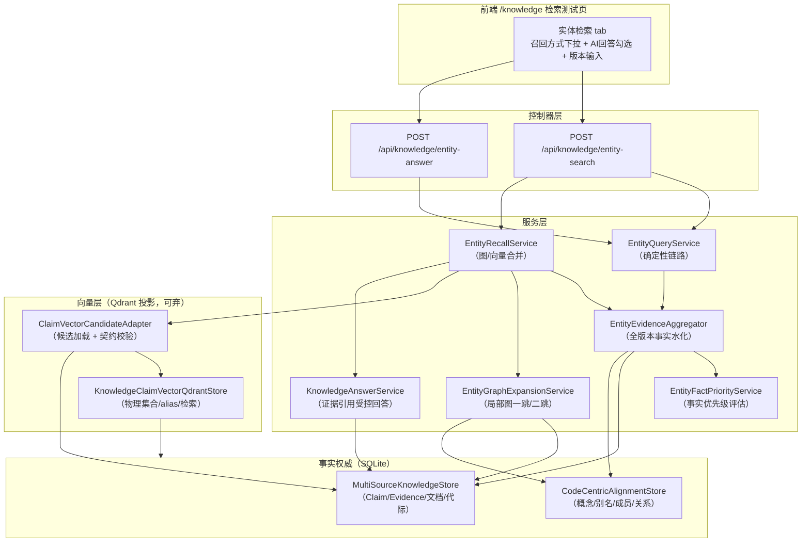
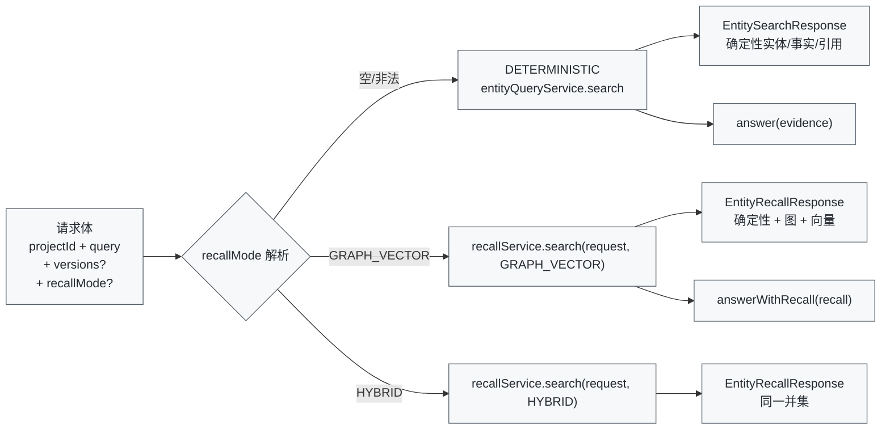
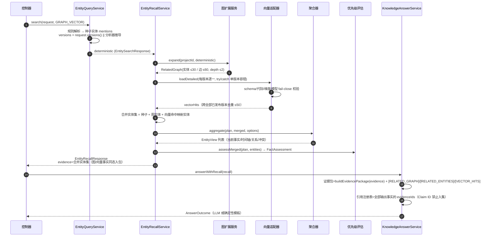
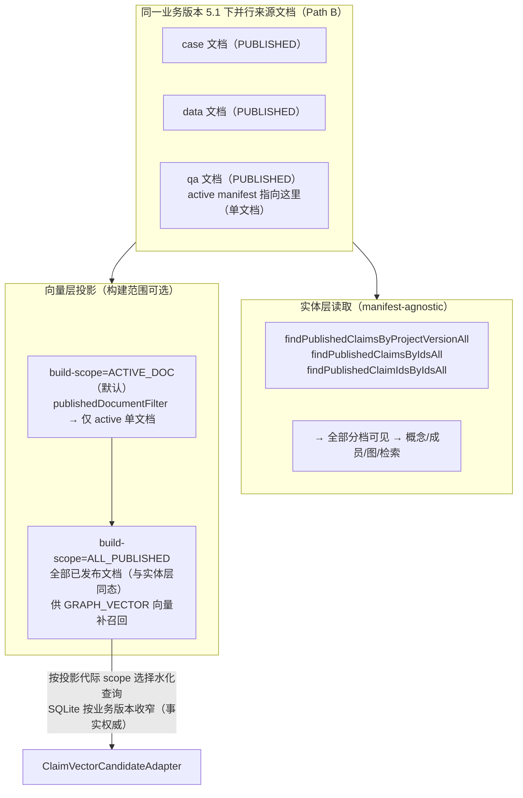
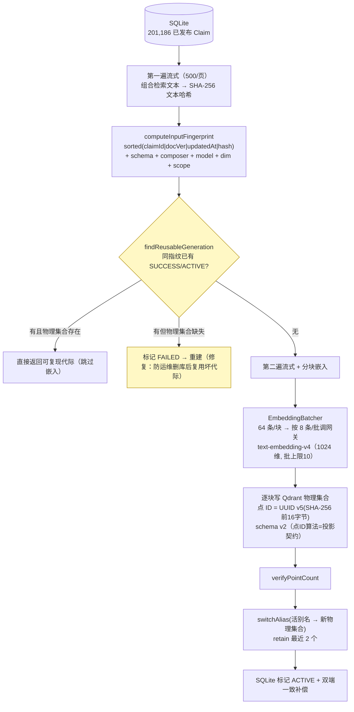
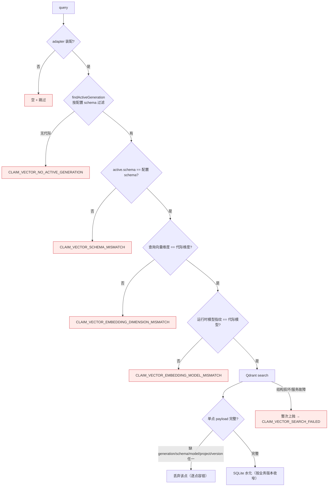
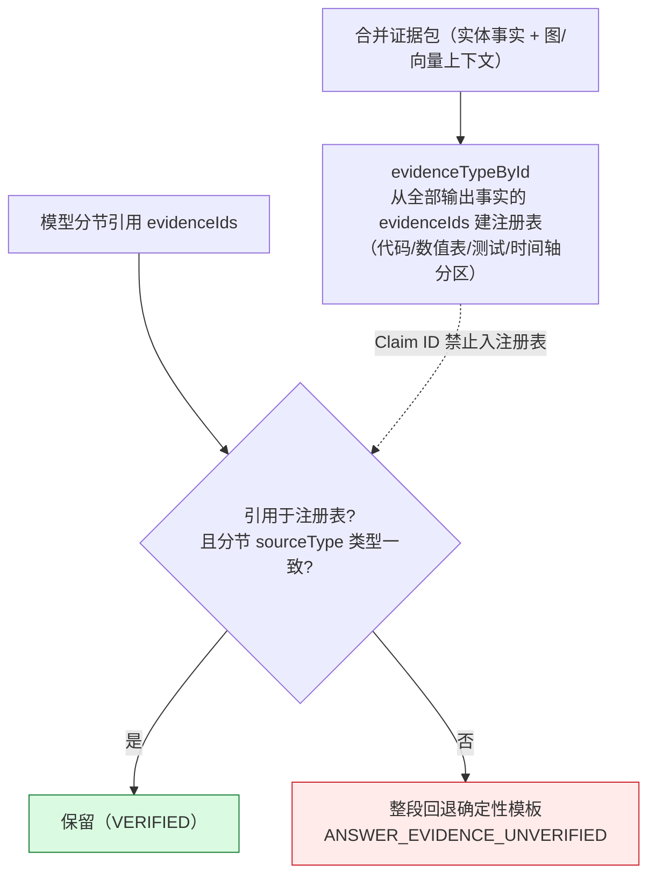
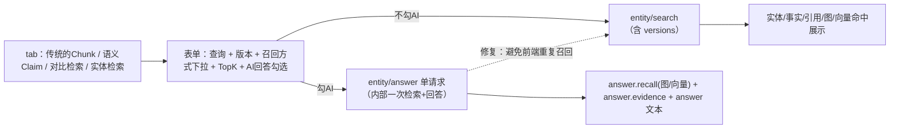

# 实体中心检索与可选召回（图/向量增强）实现文档

> 版本：0.9.7 ｜ 范围：实体中心检索 + 可选召回（`DETERMINISTIC / GRAPH_VECTOR / HYBRID`）+ Claim 向量代际投影
> 关联：`docs/entity-centric-knowledge-retrieval-implementation.md`（设计）、`.trellis/spec/backend/retrieval-and-version-knowledge.md`（契约）

---

## 1. 一句话

在确定性实体检索（规则解析 → 全版本事实聚合 → 事实优先级评估 → 证据引用回答）之上，提供**可选召回方式**：`GRAPH_VECTOR` 在确定性结果之外叠加**局部图一跳/二跳扩展**与**Claim 向量补召回**，`HYBRID` 是其并集语义；图/向量只做**召回增强**，不改变事实权威（代码/数值表优先级、类型化引用校验、发布边界）。

---

## 2. 架构总览

**核心分层**：`SQLite`（事实权威，含发布边界）⇄ `Qdrant`（向量投影，可整体丢弃重建，不参与事实裁决）⇄ `LLM`（仅做受控回答/可选辅助，引用必须回源校验）。

---

## 3. 召回模式与控制器分发

- `DETERMINISTIC`：现状默认，规则链（别名 → 成员名/代码符号 → 单候选 → LLM 受限选择 → NEEDS_REVIEW），后端行为不变。
- `GRAPH_VECTOR` / `HYBRID`：走 `EntityRecallService.search`，图与向量补召回并入证据包后再回答（两模式当前并集语义相同，保留为扩展点）。

---

## 4. GRAPH_VECTOR 一次完整请求（时序）

**关键点**：
1. `evidence.entities` 是**合并水化结果**——图/向量实体的 subject/value/unit/代码摘录/Evidence 全部进入 LLM 输入与引用允许集（修复：扩展事实此前不进 Prompt）。
2. 向量命中 Claim 先 `mapVectorHitsToEntities` 映射回实体再水化——命中会真实增加实体与事实（修复：此前只显示 vectorHits 不增加证据）。
3. `versions` 缺省 = 全部已发布业务版本；向量补召回按同一版本范围逐版本查询，**单版本失败只丢该版本**（版本级告警 `VECTOR_RECALL_UNAVAILABLE:版本 X`）。

---

## 5. 发布语义与投影范围（实体层 vs 向量层）

- **发布规则（Path B）**：`publishDocumentVersion` 只有“同一 document_id 的新版本”才降级旧 active；不同文档（case/data/qa/prd）可同时 PUBLISHED。`knowledge_active_version` 每业务版本**单行**，仅作向量投影锚点。
- **铁律**：实体层与向量层的“已发布”过滤器互不混用（实体层 = 全部 PUBLISHED；向量层默认 = active 单文档）。
- `build-scope=ALL_PUBLISHED` 让向量代际覆盖与实体层相同的文档宇宙，是 GRAPH_VECTOR 在真实多源数据上可用的前提；scope 进入代际 manifest 与输入指纹（防跨 scope 误复用）。

---

## 6. Claim 向量代际构建流水线

- **两遍流式**：第一遍只算指纹与输入集合（不驻留全量文本）；第二遍重读分页 → 组合 → 分块嵌入 → 写点（内存仅一页 + 一块）。
- **点 ID 必须是整数或 UUID**：Qdrant v1.15+ 拒绝任意字符串（64-hex 会被 400）——真实 Qdrant 集成发现的关键约束；点 ID 算法变更必须升 `projectionSchemaVersion`（当前 `knowledge-claim-vector-v2`），否则旧代际被指纹命中误复用。
- **嵌入网关**：`text-embedding-v4` @ `http://ai-gateway.momo.com/v1/embeddings`，`encoding_format=float`，**批量上限 10**（实测 8 OK / 12 拒）→ `EmbeddingBatcher.DEFAULT_BATCH_SIZE=8` 是刻意的。

---

## 7. 向量检索投影契约完整性（fail-close 树）

**设计意图**：SQLite 是事实权威，Qdrant 是可弃投影——所有“代际身份/契约”必须双向校验，且任何缺失/不符一律 **fail-close**（宁可无向量，不可错向量）；单点坏 payload 只跳该点，服务故障必须与“无命中”可区分。

---

## 8. 回答与引用校验（证据可信面）

- **Claim ID 不能冒充 Evidence ID**：注册表只放 `evidenceIds`；模型引用 `c-xxx` 这种 Claim ID → 引用不可信 → 回退模板（多次 review 反复钉死的边界）。
- **同 Claim 的第二及后续 Evidence ID 可引用**：注册表从全部输出事实建立（不只 citations 首条），合法证据不被误拒。
- 类型校验仍生效：参数表证据不能支撑“代码已实现”结论（分节必须声明单一合法 sourceType）。
- LLM 不可用 → 确定性模板（偏差报告/未确定），不编造结论。

---

## 9. 前端（/knowledge 检索测试页）

- 召回方式下拉显示中文标签（确定性 / 图+向量 / 并集），不暴露内部枚举原始码。
- 版本输入必须传给后端（`versions:[v]`），否则按“全部已发布版本”聚合——版本边界回归已修复。
- 开启 AI 回答时**只调一次** `entity-answer`（响应带完整召回包），避免两次完整召回且展示与答案证据不一致。
- 所有模式切换/页面导航统一吊销实体请求（requestId + loading + 状态清空），防旧结果串页。

---

## 10. 当前状态（真实数据）

- **代码/测试**：全量 **1105 tests 通过、0 failures**；六轮 review（14 High / 26 Medium + 文档一致性）全部修复并落进 `.trellis/spec`。
- **正在执行**：真实 Claim 向量代际构建（`ImmortalClaimVectorBuildIT`，`-Dimmortal.vector=true` 门控）——
  - 项目 `immortal` / 业务版本 `5.1`，`build-scope=ALL_PUBLISHED`（201,186 条已发布 Claim）
  - 模型：`text-embedding-v4`（1024 维，纯嵌入、无 LLM 参与构建）
  - 投影 schema `knowledge-claim-vector-v2`，点 ID UUID v5
  - 第一遍指纹遍历中（纯 CPU），随后进入 ~4 小时逐批嵌入 → Qdrant
- **构建完成后验证**：`entity-search` 带 `recallMode=GRAPH_VECTOR` → 应看到 `vectorHits` 非空、向量命中映射实体进入证据包；构建期间该 IT 不做任何其他 maven 操作（避免 target 冲突）。

## 11. 后续（可选）

1. 前端监听构建状态（`/claim-vector/builds/latest` 类端点），构建完成后提示可切“图+向量”模式。
2. 把 `GRAPH_VECTOR` 的向量命中主题分布做成可观测面板（命中来源类型占比、代际延迟），验证召回增益后再决定默认开关。
3. 若并行来源持续增长，评估 Qdrant 分片/量化（scalar int8）以降内存；检索侧候选上限（candidate×over-fetch）按实测精度调节。