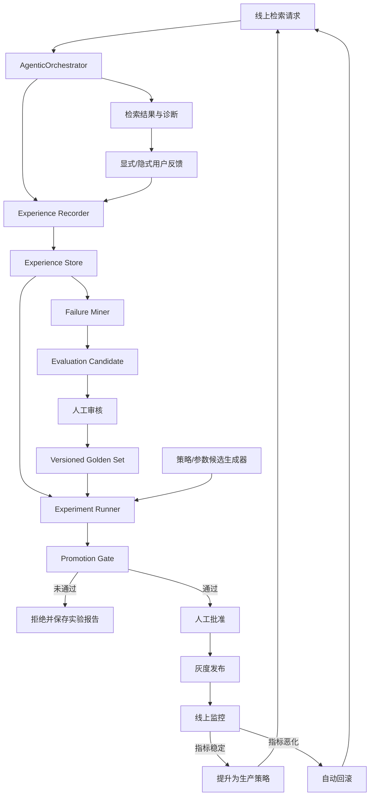
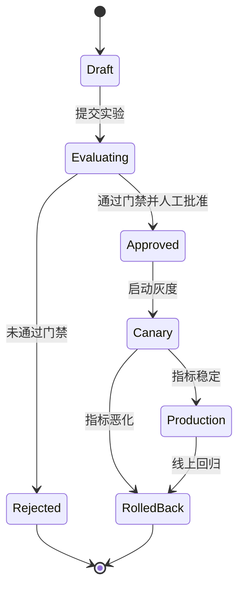

# 自进化 RAG 系统实现方案

> 日期：2026-08-16  
> 目标项目：NEXUS / request-RAG  
> 实施原则：先建立可观测、可评测、可回滚的离线进化闭环，再逐步引入自动策略优化

## 1. 背景

当前系统已经具备 Agentic 检索、自反思、多跳补检、离线评测、知识草稿审核和版本回滚等能力，但这些能力尚未形成完整的学习闭环：

- 在线请求的策略、候选集、反思结果和用户反馈没有沉淀为可重放经验；
- 失败案例依赖人工临时分析，不能稳定进入评测集；
- 检索规则和参数主要由人工直接修改，缺少统一的实验、准入和发布流程；
- 线上指标与离线评测之间没有策略版本、数据集版本和索引版本关联；
- 系统可以“反思本次结果”，但不能从一批历史结果中总结并生成下一版策略。

因此，本方案中的“自进化”定义为：

> 系统持续采集检索经验，自动发现高价值失败样本，生成策略或参数候选，通过历史经验回放和正式评测验证后，经人工批准或受控门禁灰度发布，并在指标恶化时自动回滚。

自进化的第一目标不是让 Agent 自动修改代码，而是让检索质量优化从一次性人工调参升级为可重复、可审计的工程闭环。

## 2. 目标与边界

### 2.1 核心目标

1. 每次检索都能关联策略版本、配置版本、索引版本和评测数据集版本。
2. 自动聚合低质量请求，形成可审核的评测样本候选。
3. 支持对规则、阈值、策略路由和排序权重进行离线搜索与回放。
4. 只有通过质量门禁的候选策略才能进入灰度。
5. 灰度期间指标恶化时自动停止发布并回滚。
6. 所有策略变更均可解释、可复现、可审计。

### 2.2 非目标

第一阶段不实现以下能力：

- Agent 自动修改 Java/Python 源码并直接部署；
- 仅依据 LLM 自评结果修改线上策略；
- 未经正式评测自动扩充 golden set；
- 无版本记录地在线更新权重；
- 使用线上用户流量进行无保护的随机探索；
- 同时训练或微调 Embedding、Reranker 和生成模型。

### 2.3 核心约束

- 自动优化只生成候选，不默认获得生产发布权。
- 用户反馈是弱标签，不能直接当作唯一真值。
- 正式评测集必须经过人工审核并保留变更记录。
- 候选策略必须能在固定输入、固定索引和固定配置下重放。
- 新模块必须可通过配置关闭，关闭后保持现有检索行为。
- 默认不持久化完整敏感源码或需求正文，优先保存 ID、hash 和截断摘要。

## 3. 当前基础与主要差距

| 能力 | 当前实现 | 可复用点 | 主要差距 |
|---|---|---|---|
| Agent 编排 | `AgenticOrchestrator.execute()` | 最多两跳、补检、降级交付 | 未记录每跳候选、策略决策依据和策略版本 |
| 策略路由 | `RetrievalStrategySelector` | 首跳策略接口稳定 | 当前仅规则匹配，规则与参数不可版本化 |
| 证据反思 | `EvidenceReflector` | 稳定 verdict 和 reason code | 只判断单次结果，未用于跨请求失败挖掘 |
| 可观测性 | `RagObservability` | stage/status/warning/duration 指标 | 缺少经验事件、候选排名、反馈和版本关联 |
| 离线评测 | `RetrievalEvaluationReport`、`tools/retrieval-eval-comparison.py` | Recall、MRR、nDCG、延迟和非回归比较 | 尚未成为候选策略发布的强制门禁 |
| 知识生命周期 | `KnowledgeDraftLifecycleService` | 审核、发布、拒绝、回滚 | 尚无对应的策略候选生命周期 |
| 增量更新 | `VersionKnowledgeBuildPipeline`、`ModuleStaleRebuildService` | 版本构建、陈旧检测和重建 | 索引/知识变化尚未反馈到失败归因 |

当前正式评测结果可作为自进化系统的首个生产基线：

| 指标 | 当前基线 |
|---|---:|
| Recall@1 | 93.6% |
| MRR@10 | 0.9596 |
| nDCG@10 | 0.9688 |
| P95 | 436ms |

这些值是现有评测结果，不代表自进化模块已经带来的收益。后续每次策略晋级都应与固定基线和当前生产策略同时比较。

## 4. 总体架构



系统分为三条链路：

1. **在线执行链路**：执行检索并异步记录经验，不阻塞主请求。
2. **离线进化链路**：挖掘失败、审核样本、生成候选并执行可重放评测。
3. **受控发布链路**：门禁、人工批准、灰度、监控和回滚。

## 5. 核心数据模型

### 5.1 RetrievalExperience

建议新增：

`src/main/java/com/example/requirementrag/evolution/experience/RetrievalExperience.java`

```java
public record RetrievalExperience(
        String experienceId,
        Instant occurredAt,
        String projectId,
        String documentId,
        String version,
        String queryHash,
        String queryPreview,
        String retrievalProfile,
        String selectedStrategy,
        List<String> executedStrategies,
        int hops,
        List<CandidateSnapshot> candidates,
        List<String> finalRanking,
        List<String> evidenceIds,
        String reflectionVerdict,
        String reflectionReasonCode,
        String outcomeStatus,
        List<String> warningCodes,
        List<StageSnapshot> diagnostics,
        long latencyMs,
        Long tokenCost,
        List<String> degradedStages,
        UserFeedback feedback,
        String policyVersion,
        String configHash,
        String indexVersion,
        String datasetVersion
) {}
```

设计要求：

- `experienceId` 全局唯一，并贯穿在线日志、反馈和离线实验。
- `queryHash` 用于聚类和去重；`queryPreview` 默认截断并可配置关闭。
- 候选至少保存候选 ID、来源通道、原始排名、最终排名和关键分数。
- `policyVersion + configHash + indexVersion` 必须足以复现实验。
- 记录每一跳的策略与反思结果，不能只记录最终合并结果。
- 经验事件采用版本化 schema，例如 `schemaVersion=1`。

### 5.2 EvaluationCandidate

```java
public record EvaluationCandidate(
        String candidateId,
        String sourceExperienceId,
        String queryHash,
        String failureType,
        String failureReason,
        List<String> predictedRelevantIds,
        double priorityScore,
        ReviewStatus reviewStatus,
        String reviewer,
        Instant reviewedAt
) {}
```

`failureType` 建议使用稳定枚举：

- `NO_HIT`
- `TOP1_MISMATCH`
- `LOW_RANK`
- `DUPLICATE_ONLY`
- `SINGLE_SIDE_ONLY`
- `CORE_STAGE_FAILED`
- `USER_REJECTED`
- `HIGH_LATENCY`
- `DEGRADED_RESULT`
- `INDEX_STALENESS`

### 5.3 RetrievalPolicy

```java
public record RetrievalPolicy(
        String policyId,
        String version,
        PolicyStatus status,
        Map<String, Object> selectorRules,
        Map<String, Double> rankingWeights,
        Map<String, Integer> thresholds,
        Map<String, Boolean> featureFlags,
        String parentVersion,
        String experimentId,
        String checksum,
        Instant createdAt
) {}
```

策略只描述可配置行为，不包含可执行脚本。首期允许进化的参数范围应使用 allowlist：

- 查询类型到首跳策略的映射；
- 最大补检跳数；
- `EvidenceReflector` 命中阈值；
- dense / sparse / desc_dense 融合权重；
- 结构化重排权重；
- 不同查询类型的 `topK`；
- 可选重排器是否启用。

## 6. 模块设计

建议新增根包：

```text
src/main/java/com/example/requirementrag/evolution/
├── experience/
├── mining/
├── evaluation/
├── policy/
├── rollout/
└── scheduling/
```

### 6.1 Experience Recorder

建议类：

- `RetrievalExperienceRecorder`
- `RetrievalExperienceStore`
- `FileRetrievalExperienceStore`
- 后续可选 `JdbcRetrievalExperienceStore`

接入位置：

- 在 `AgenticOrchestrator.execute()` 内收集每跳策略、候选和反思结果；
- 在统一请求入口补充总延迟、请求上下文和最终反馈关联 ID；
- 复用 `RagObservability` 的 status、warning 和 diagnostic 语义；
- 使用事件或异步队列落盘，存储失败不得影响在线检索。

首期存储建议使用 JSONL：

```text
data/evolution/experiences/YYYY-MM-DD.jsonl
```

理由：

- 便于快速落地、离线回放和人工检查；
- 与当前 JSONL 评测工具链兼容；
- schema 稳定后再迁移 SQLite 或 PostgreSQL。

必须实现：

- 单文件轮转；
- 写入失败计数；
- 脱敏和字段截断；
- 保留周期配置；
- schema 版本迁移策略；
- 按 `experienceId` 去重。

### 6.2 Failure Miner

建议类：

- `RetrievalFailureMiner`
- `FailureRule`
- `FailureClusterer`
- `EvaluationCandidateStore`

失败来源分为四类：

1. **系统显式失败**：FAILED、DEGRADED、warning、核心阶段异常。
2. **反思失败**：`BELOW_MIN_HITS`、`DUPLICATE_ONLY`、`SINGLE_SIDE_ONLY`。
3. **用户反馈失败**：用户拒绝证据、重新提问、选择了非 Top1 结果。
4. **评测失败**：Recall@1 未命中、相关结果排名过低、延迟超阈值。

候选优先级可以先使用确定性评分：

```text
priority =
    severityWeight
  * occurrenceCount
  * affectedProjectWeight
  * feedbackConfidence
  * reproducibility
  / duplicatePenalty
```

首期不需要 LLM 自动标注正确答案。LLM 只能用于生成聚类摘要或建议 failure type，最终 relevant ID 仍需人工确认。

### 6.3 Evaluation Case Review

建议类：

- `EvaluationCaseReviewService`
- `EvaluationDatasetRegistry`
- `EvaluationDatasetVersion`

可复用 `KnowledgeDraftLifecycleService` 的状态机思想：

```text
DRAFT → IN_REVIEW → APPROVED → PUBLISHED
              └──→ REJECTED
PUBLISHED → ROLLED_BACK
```

审核界面或 API 至少支持：

- 查看原始查询、脱敏上下文、候选排名和关键诊断；
- 标记正确相关项及其相关等级；
- 判断属于检索失败、索引失败、标注错误还是不可检索问题；
- 合并重复样本；
- 记录审核人和审核理由；
- 发布新的不可变数据集版本；
- 回滚到上一数据集版本。

正式评测数据和自动挖掘候选必须物理或逻辑隔离，避免未经审核的弱标签污染 golden set。

### 6.4 Experiment Runner

建议类：

- `EvolutionExperimentRunner`
- `ExperienceReplayRunner`
- `PolicyCandidateGenerator`
- `ExperimentManifest`
- `ExperimentReport`

实验输入：

- 基线策略版本；
- 候选策略版本；
- 固定数据集版本；
- 固定索引版本；
- 固定模型及服务版本；
- 随机种子；
- 重复运行次数。

实验输出：

- Recall@1 / @5 / @10；
- MRR@10；
- nDCG@10；
- P50 / P95 / P99；
- 错误率、降级率和补检率；
- 按查询类型、项目、failure type 的切片指标；
- 每个样本的排名变化；
- 相对基线的提升和回退；
- 完整运行清单及配置 hash。

`EvolutionExperimentRunner` 应优先调用现有正式评测入口，并复用：

- `RetrievalEvaluationReport`
- `tools/retrieval-eval-comparison.py`

不要在自进化模块中实现第二套指标计算逻辑。

### 6.5 Policy Candidate Generator

按风险从低到高分三层推进。

#### 第一层：确定性参数搜索

- 网格搜索或贝叶斯优化排序权重；
- 调整不同查询类型的召回通道权重；
- 调整反思阈值、topK 和补检条件；
- 约束搜索空间，所有参数都有上下界。

#### 第二层：规则评分器

为 `RetrievalStrategySelector` 增加特征化评分：

```text
score(strategy | query) =
    profileWeight
  + codeIntentWeight
  + symbolPatternWeight
  + historySuccessRate
  - latencyPenalty
  - degradationPenalty
```

评分器仍输出确定性策略，并保留当前规则选择器作为回退。

#### 第三层：Contextual Bandit

只有在以下条件满足后再引入：

- 已有稳定、高覆盖的反馈；
- 能区分展示偏差和真实相关性；
- 具备离线反事实评估或低风险探索机制；
- 灰度、熔断和回滚经过验证。

Bandit 只负责有限策略集合的路由，不直接生成任意检索代码。

### 6.6 Policy Registry

建议类：

- `RetrievalPolicyRegistry`
- `PolicyLifecycleService`
- `PolicyPromotionGate`



策略发布必须使用不可变版本。生产环境只保存当前激活版本引用，切换和回滚通过原子更新引用完成。

### 6.7 Rollout Service

建议类：

- `PolicyRolloutService`
- `RolloutAssignment`
- `RolloutMonitor`
- `AutomaticRollbackPolicy`

灰度分流使用稳定 hash：

```text
bucket = hash(projectId + requestStableKey) % 100
```

首期建议：

- 5% 流量观察；
- 通过后扩大到 20%；
- 再扩大到 50%；
- 最后提升为 100%。

每一阶段均设置最小样本量和最短观察时间，避免少量请求导致误判。

## 7. 在线采集链路

建议调整 `AgenticOrchestrator` 的内部执行上下文：

```java
EvolutionTrace trace = traceFactory.start(request, activePolicy);
try {
    // 每跳记录 selector 输入、选中策略、候选、反思和耗时
    return executeWithTrace(request, trace);
} finally {
    experienceRecorder.recordAsync(trace.finish());
}
```

采集要求：

1. Recorder 不应进入策略判断逻辑，避免观测代码改变业务行为。
2. 异步队列满时允许丢弃低价值成功事件，但不能阻塞在线请求。
3. 失败、降级和用户负反馈事件应有更高采样优先级。
4. 对成功请求可按比例采样，失败请求默认全量记录。
5. 在日志和响应诊断中暴露 `experienceId`，便于追踪。
6. 用户反馈通过独立接口按 `experienceId` 回填，不修改原始经验事件。

建议配置：

```yaml
app:
  rag:
    evolution:
      enabled: false
      experience-recording-enabled: false
      success-sample-rate: 0.1
      failure-sample-rate: 1.0
      queue-capacity: 1000
      query-preview-enabled: false
      retention-days: 30
```

所有功能初始默认关闭，先在开发和评测环境验证事件完整性。

## 8. 失败挖掘与评测集演进

### 8.1 定时任务

`EvolutionScheduler` 每日执行：

1. 读取尚未分析的经验；
2. 应用失败规则；
3. 按 `queryHash + failureType + indexVersion` 去重；
4. 聚合出现次数和影响范围；
5. 生成 `EvaluationCandidate`；
6. 输出待审核队列和日报。

### 8.2 归因顺序

失败归因应按以下顺序执行，避免把数据问题误判为策略问题：

1. 目标内容是否存在于当前代码/需求版本；
2. 目标是否已被解析和索引；
3. 候选池中是否存在正确结果；
4. 正确结果是否在融合或重排阶段掉出；
5. 策略选择是否错误；
6. 反思器是否错误地提前停止；
7. 用户反馈是否可靠。

对应处理：

| 根因 | 进入策略优化 | 进入数据/索引修复 | 进入评测集 |
|---|---:|---:|---:|
| 未索引 | 否 | 是 | 修复后再决定 |
| 候选未召回 | 是 | 可能 | 是 |
| 排序错误 | 是 | 否 | 是 |
| 策略路由错误 | 是 | 否 | 是 |
| 评测标注错误 | 否 | 否 | 修正原样本 |
| 不可检索问题 | 否 | 否 | 标记排除或单独统计 |

## 9. Promotion Gate

以下阈值是首期建议默认值，需要通过多轮实验校准，不是已经实现的性能结果。

### 9.1 离线质量门禁

候选策略必须同时满足：

- Recall@1 相对当前生产策略提升至少 `1pp`，或关键失败子集提升至少 `5pp`；
- Recall@10 不得回退；
- nDCG@10 回退不得超过 `0.5pp`；
- MRR@10 不得显著回退；
- P95 增幅不超过 `10%`；
- FAILED、DEGRADED 和核心阶段失败率不得恶化；
- 至少重复运行 3 次，结论方向一致；
- 所有 formal run 必须成功；
- 不允许只报告总体指标，必须检查各查询类型切片。

对于当前 Recall@1 已达到 93.6% 的情况，“提升至少 1pp”可能过严。若候选主要修复低频长尾，可使用双轨准入：

```text
总体指标不回退
AND 目标失败集显著改善
AND 延迟、错误率、降级率满足门禁
```

### 9.2 线上灰度门禁

建议监控：

- 用户接受率或正反馈率；
- 重复提问率；
- 无结果率；
- 降级率；
- 补检率和平均 hops；
- P95 / P99；
- 各 warning code 比例；
- 单项目异常；
- 成本变化。

自动回滚条件示例：

- P95 连续两个窗口恶化超过 15%；
- FAILED 或 DEGRADED 比例超过基线 20%；
- 用户负反馈率显著上升；
- 出现策略加载失败、配置校验失败或版本不一致；
- 关键项目出现连续失败。

## 10. 分阶段实施计划

### Phase 0：事件契约与安全开关

目标：定义可进化系统的边界，不改变现有检索结果。

任务：

- 定义 `RetrievalExperience` schema；
- 定义策略、索引、配置和数据集版本规范；
- 增加 `app.rag.evolution.*` 配置；
- 定义脱敏、采样和保留策略；
- 为 `AgenticOrchestrator` 设计 trace 接口；
- 建立 schema 兼容性测试。

验收：

- 开关关闭时行为和性能与当前版本一致；
- 单元测试覆盖事件字段和脱敏规则；
- schema 文档可独立用于实现生产者和消费者。

### Phase 1：Experience Recorder

目标：形成可重放的在线经验数据。

任务：

- 实现 recorder、store 和异步写入；
- 记录每跳策略、候选、反思、状态和版本；
- 支持反馈回填；
- 接入 Micrometer 队列深度、写入失败和丢弃计数；
- 实现 JSONL 轮转和保留清理。

验收：

- 评测请求可以生成完整经验事件；
- 写入失败不影响检索响应；
- 任一经验可定位到策略、配置和索引版本；
- 敏感正文默认不落盘。

### Phase 2：Failure Miner 与人工审核

目标：把线上失败稳定转化为高质量评测样本。

任务：

- 实现规则化失败归因；
- 实现去重、聚类和优先级；
- 增加候选审核 API；
- 增加数据集注册表和不可变版本；
- 生成候选日报。

验收：

- 已知失败可被正确归类；
- 重复失败不会产生大量重复候选；
- 未审核样本无法进入正式评测集；
- 每个 published 数据集版本可回滚和复现。

### Phase 3：Experiment Runner

目标：让候选策略可以自动完成离线回放和对比。

任务：

- 封装现有 formal eval；
- 引入 experiment manifest；
- 同时运行生产策略与候选策略；
- 输出总体、切片和逐样本差异；
- 支持固定随机种子和多次运行；
- 保存完整实验报告。

验收：

- 相同 manifest 可复现相同结果；
- 与现有评测脚本计算结果一致；
- 报告能定位每个 Top1 改善和回退样本；
- 评测失败时策略不能晋级。

### Phase 4：Policy Registry 与 Promotion Gate

目标：建立策略候选的审核、发布和回滚生命周期。

任务：

- 实现策略 schema 和参数 allowlist；
- 实现策略注册表和状态机；
- 实现离线质量门禁；
- 增加人工批准接口；
- 支持原子激活和回滚；
- 当前规则策略注册为 `baseline-v1`。

验收：

- 非法参数不能注册；
- 未通过 formal eval 的策略不能批准；
- 激活策略失败时继续使用上一生产版本；
- 所有状态变化均有审计记录。

### Phase 5：灰度与自动回滚

目标：安全验证离线提升是否能转化为线上收益。

任务：

- 实现稳定分桶；
- 实现 5% → 20% → 50% → 100% 发布流程；
- 实现线上指标比较；
- 实现熔断和自动回滚；
- 增加项目 allowlist 和 kill switch。

验收：

- 同一稳定 key 始终进入同一策略桶；
- 回滚不需要重新部署应用；
- 触发阈值后在目标时间内恢复生产策略；
- 灰度报告能关联具体策略和经验数据。

### Phase 6：策略学习

目标：从人工调参升级为系统自动生成有限范围的候选。

任务：

- 先实现受约束的参数搜索；
- 再实现可解释规则评分器；
- 评估反馈覆盖率和偏差；
- 条件成熟后验证 Contextual Bandit；
- 保持规则选择器作为永久回退。

验收：

- 自动生成的候选不能绕过 Registry 和 Gate；
- 每个参数变化均有来源和收益归因；
- 学习策略加载失败时自动回退；
- 探索流量有严格预算且可立即关闭。

## 11. 文件级改动清单

### 11.1 新增文件

```text
src/main/java/com/example/requirementrag/evolution/
├── experience/RetrievalExperience.java
├── experience/RetrievalExperienceRecorder.java
├── experience/RetrievalExperienceStore.java
├── experience/FileRetrievalExperienceStore.java
├── mining/RetrievalFailureMiner.java
├── mining/EvaluationCandidate.java
├── mining/EvaluationCandidateStore.java
├── evaluation/EvaluationCaseReviewService.java
├── evaluation/EvaluationDatasetRegistry.java
├── evaluation/EvolutionExperimentRunner.java
├── evaluation/ExperimentManifest.java
├── evaluation/ExperimentReport.java
├── policy/RetrievalPolicy.java
├── policy/RetrievalPolicyRegistry.java
├── policy/PolicyLifecycleService.java
├── policy/PolicyPromotionGate.java
├── rollout/PolicyRolloutService.java
├── rollout/RolloutMonitor.java
├── rollout/AutomaticRollbackPolicy.java
└── scheduling/EvolutionScheduler.java
```

### 11.2 修改文件

| 文件 | 修改目的 |
|---|---|
| `retrieval/agentic/AgenticOrchestrator.java` | 创建 trace，记录每跳策略与反思，不改变现有编排语义 |
| `retrieval/agentic/RetrievalStrategySelector.java` | 支持从版本化 policy 读取规则，保留规则回退 |
| `retrieval/agentic/EvidenceReflector.java` | 阈值配置化，保持 reason code 稳定 |
| `observability/RagObservability.java` | 增加 evolution 队列、策略版本、灰度和回滚指标 |
| 配置属性类与 `application.yml` | 增加 evolution 配置及默认关闭开关 |
| `KnowledgeBuildController.java` 或独立控制器 | 增加候选审核、策略批准和回滚 API |
| 正式评测入口 | 接受 policy/index/dataset version 并输出 manifest |
| `CHANGELOG.md` | 每个实际代码阶段提交时同步记录；本设计文档阶段不提前声明功能已交付 |

建议新增独立控制器 `EvolutionController`，避免把策略生命周期和知识草稿 API 混在一起。

## 12. 测试方案

### 12.1 单元测试

- Experience schema 序列化与向后兼容；
- 脱敏、截断和 hash 稳定性；
- 异步队列满、写入失败和关闭流程；
- failure rule 分类与优先级；
- 数据集状态机非法转换；
- policy 参数 allowlist 和校验；
- promotion gate 边界值；
- 稳定分桶；
- 自动回滚阈值。

### 12.2 集成测试

- `AgenticOrchestrator` 每跳 trace 完整；
- Recorder 故障不改变检索结果；
- 经验事件到候选审核再到数据集发布的完整链路；
- Experiment Runner 与现有评测工具结果一致；
- 策略批准、灰度、提升和回滚状态流转；
- 应用重启后生产策略版本正确恢复。

### 12.3 回归测试

- evolution 全关闭时，当前 Agentic 流程结果不变；
- `CONFIDENT / INSUFFICIENT / NOT_RETRIEVABLE` 行为不变；
- Recall@1、Recall@10、MRR 和 nDCG 计算不变；
- 旧配置文件无需新增字段也能启动；
- 存量策略不存在时自动使用内置规则基线。

### 12.4 故障注入

- Experience Store 不可写；
- 异步队列持续满；
- 策略文件损坏；
- 索引版本与策略声明不一致；
- formal eval 超时；
- 灰度监控数据缺失；
- 回滚过程中应用重启。

## 13. 验收指标

### 13.1 工程指标

| 指标 | 目标 |
|---|---:|
| 经验事件完整率 | >= 99% |
| 失败事件采集率 | >= 99.9% |
| Recorder 对在线 P95 的影响 | <= 2% |
| 可复现实验比例 | 100% |
| 未审核样本进入正式集 | 0 |
| 未通过门禁策略进入灰度 | 0 |
| 策略回滚成功率 | 100% |

### 13.2 效果指标

首期不承诺固定提升值，以每个候选实验为准。系统上线后建议用以下指标衡量自进化机制本身：

- 从失败发生到进入待审核队列的时间；
- 候选样本审核通过率；
- 每个评测集版本新增的有效长尾样本数；
- 候选策略通过门禁的比例；
- 每次策略发布修复的失败样本数；
- Recall@1 / MRR / nDCG 的累计变化；
- 单位提升带来的延迟和成本变化；
- 灰度回滚次数与误发布率。

## 14. 风险与降级

| 风险 | 影响 | 控制措施 |
|---|---|---|
| 用户反馈噪声 | 策略向错误目标优化 | 弱标签不直接进入 golden set，人工审核 |
| 评测集过拟合 | 离线提升、线上无收益 | 保留独立 holdout，按时间切分，检查切片指标 |
| 数据漂移 | 历史经验失效 | 绑定项目、版本和索引版本，设置时间窗口 |
| 探索伤害线上请求 | 质量回退 | 首期不在线探索，后续设置预算、allowlist 和 kill switch |
| 经验数据泄露 | 源码或需求外泄 | 默认只存 ID/hash，字段脱敏、保留期和访问审计 |
| 自动调参扩大成本 | 延迟或调用成本上涨 | 将延迟、补检率和 token cost 纳入硬门禁 |
| LLM 自评偏差 | 错误样本和错误策略 | 规则信号优先，LLM 仅辅助摘要和建议 |
| 策略与索引不兼容 | 线上不可复现 | 策略声明兼容索引版本，激活前校验 |
| Recorder 影响主链路 | 在线延迟或故障 | 异步、限流、丢弃策略、独立开关 |

全局降级顺序：

```text
关闭在线灰度
→ 回滚到上一生产策略
→ 关闭策略动态加载，使用内置规则
→ 关闭 Failure Miner
→ 关闭 Experience Recorder
```

任何 evolution 子系统故障都不得阻止基础检索服务启动和执行。

## 15. 推荐实施顺序与工期

| 里程碑 | 范围 | 建议工期 |
|---|---|---:|
| M1 | Phase 0-1：事件契约与经验采集 | 1-2 周 |
| M2 | Phase 2：失败挖掘与样本审核 | 1-2 周 |
| M3 | Phase 3：实验回放与报告 | 1-2 周 |
| M4 | Phase 4：策略注册表与门禁 | 1-2 周 |
| M5 | Phase 5：灰度和自动回滚 | 1-2 周 |
| M6 | Phase 6：参数搜索与学习路由 | 2-4 周 |

建议最小可行版本止于 M4。完成 M1-M4 后，项目已经具备“经验采集 → 失败发现 → 样本演进 → 候选策略 → 离线门禁 → 人工发布”的完整受控自进化闭环；灰度和在线学习应在闭环稳定后继续。

## 16. 简历成果表达模板

实施前不应填写未经测量的性能提升。完成后可按真实实验替换方括号：

> 设计并实现面向代码与需求检索的自进化 Agent 闭环，构建在线 Experience Replay、失败样本挖掘、版本化评测集、策略实验与 Promotion Gate，实现策略候选自动生成、离线回放、灰度发布及自动回滚；累计沉淀 `[N]` 条高价值失败样本，使 Recall@1 从 `[A]%` 提升至 `[B]%`，MRR 提升 `[X]`，P95 延迟增幅控制在 `[Y]%` 内。

若只完成离线闭环，可写：

> 将 RAG 优化流程从人工排查升级为可复现的离线自进化闭环，打通检索经验采集、失败归因、评测样本审核、受约束参数搜索和质量门禁，支持策略、索引、配置与数据集四类版本追踪，避免未通过 Recall/nDCG/延迟非回归验证的策略进入生产。

## 17. 最终建议

项目最值得先做的不是 Contextual Bandit 或 LLM 自动改代码，而是 Phase 0-4：

1. 让每次检索成为可重放的经验；
2. 让失败自动进入可审核队列；
3. 让评测集持续吸收真实长尾问题；
4. 让规则和参数成为版本化策略；
5. 让每个候选必须经过正式评测和发布门禁。

完成这五点后，系统已经具备可靠的“自进化骨架”。后续无论接入参数优化、规则学习、Bandit 还是 LLM 策略生成，都只是在同一个可验证闭环中替换候选生成器，而不需要重新设计安全和评测体系。
